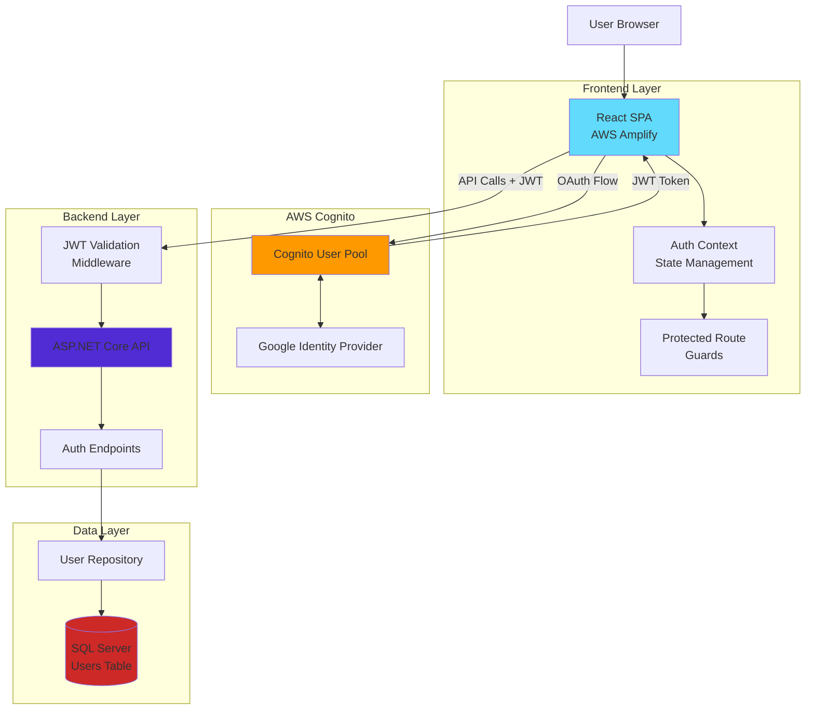
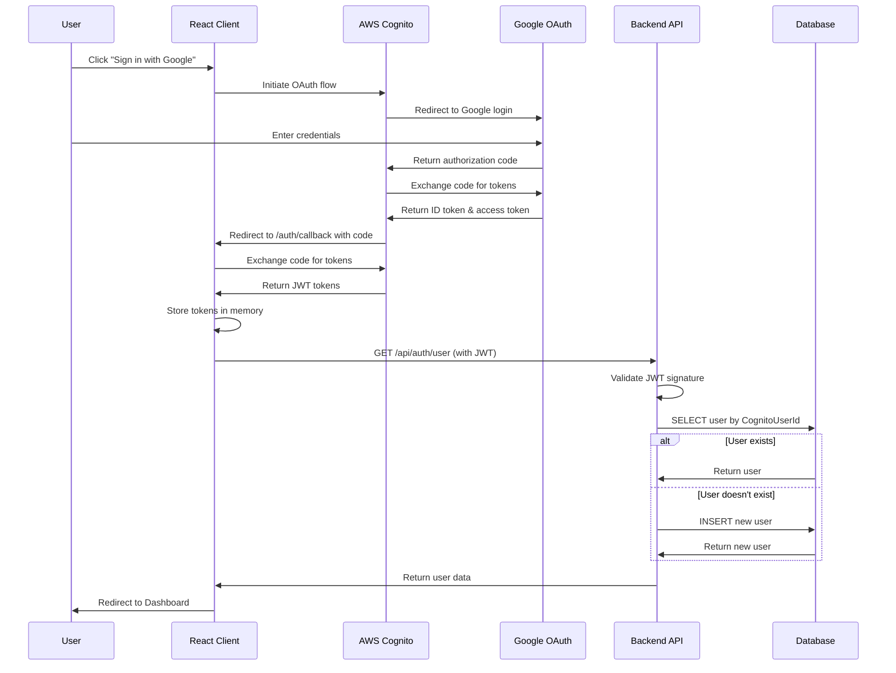
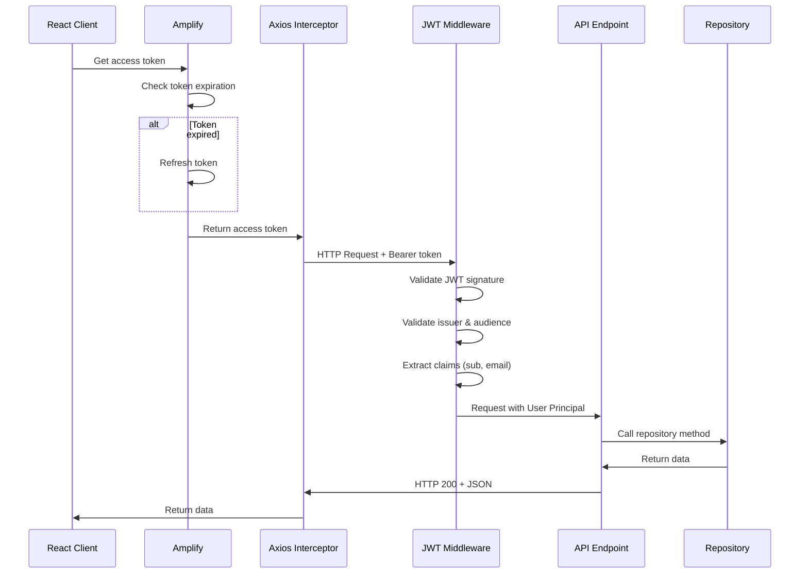
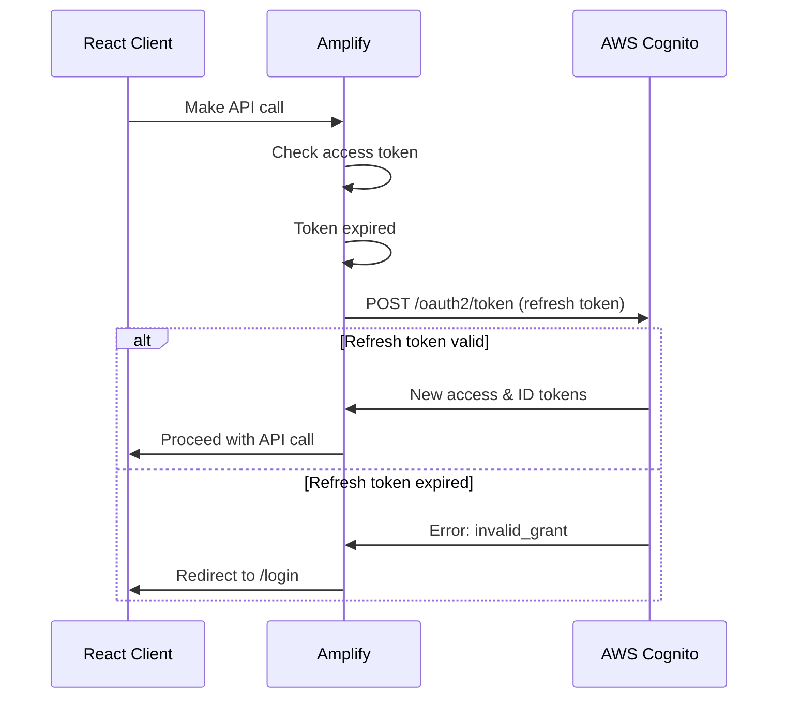
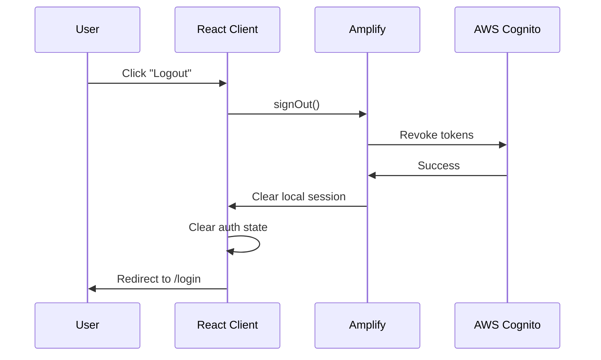

# AWS Cognito Authentication Architecture

**Document:** ARCH-01  
**Version:** 1.0  
**Status:** Design Phase  
**Last Updated:** December 21, 2025  
**Author:** Software Architecture Team

---

## Table of Contents
1. [Executive Summary](#executive-summary)
2. [Architecture Overview](#architecture-overview)
3. [Component Design](#component-design)
4. [Authentication Flows](#authentication-flows)
5. [Integration with Clean Architecture](#integration-with-clean-architecture)
6. [Technology Stack](#technology-stack)
7. [Configuration Management](#configuration-management)
8. [Error Handling Strategy](#error-handling-strategy)
9. [Performance Considerations](#performance-considerations)
10. [Security Considerations](#security-considerations)

---

## Executive Summary

###Purpose
This document defines the comprehensive architecture for implementing AWS Cognito-based authentication in the BudgetTracker application, enabling secure user authentication through Google OAuth while maintaining the existing Clean Architecture principles.

### Key Design Decisions
- **Primary Identity Provider:** Google OAuth 2.0 via AWS Cognito
- **Token Strategy:** JWT with 1-hour access tokens, 30-day refresh tokens
- **Frontend Library:** AWS Amplify for React
- **Backend Authentication:** ASP.NET Core JWT Bearer middleware
- **Session Strategy:** Token-based (stateless API)

### Design Goals
1. **Security**: Industry-standard OAuth 2.0 / OpenID Connect
2. **User Experience**: < 3 second authentication, seamless session management
3. **Scalability**: Leverage AWS Cognito's managed infrastructure
4. **Maintainability**: Minimal code, use proven libraries
5. **Compliance**: Clean Architecture principles preserved

---

## Architecture Overview

### High-Level Architecture



### System Context

The authentication system sits at the intersection of:
- **Frontend**: React SPA with AWS Amplify integration
- **Identity Provider**: AWS Cognito + Google OAuth
- **Backend API**: ASP.NET Core with JWT validation
- **Data Store**: SQL Server with User table

### Key Components

1. **AWS Cognito User Pool**
   - Manages user authentication
   - Federates with Google
   - Issues JWT tokens

2. **Frontend Auth Layer**
   - AWS Amplify library
   - React Context for auth state
   - Protected route components

3. **Backend Auth Layer**
   - JWT validation middleware
   - User creation/lookup logic
   - Protected endpoint enforcement

4. **Database Layer**
   - User table with CognitoUserId
   - User profile information

---

## Component Design

### Frontend Components

#### 1. Amplify Configuration (`cognitoConfig.ts`)
```typescript
import { Amplify } from 'aws-amplify';

Amplify.configure({
  Auth: {
    Cognito: {
      userPoolId: process.env.VITE_COGNITO_USER_POOL_ID,
      userPoolClientId: process.env.VITE_COGNITO_CLIENT_ID,
      loginWith: {
        oauth: {
          domain: process.env.VITE_COGNITO_DOMAIN,
          scopes: ['openid', 'email', 'profile'],
          redirectSignIn: [window.location.origin + '/auth/callback'],
          redirectSignOut: [window.location.origin + '/login'],
          responseType: 'code', // Authorization code grant
          providers: ['Google']
        }
      }
    }
  }
});
```

**Design Rationale:**
- Environment variables for configuration (12-factor app)
- Authorization code grant flow (most secure OAuth flow)
- Dynamic redirect URLs (works in all environments)

#### 2. Auth Context (`AuthContext.tsx`)
```typescript
interface AuthContextType {
  user: CognitoUser | null;
  isAuthenticated: boolean;
  isLoading: boolean;
  signInWithGoogle: () => Promise<void>;
  logout: () => Promise<void>;
  getAccessToken: () => Promise<string | null>;
}

export function AuthProvider({ children }: { children: ReactNode }) {
  const [user, setUser] = useState<CognitoUser | null>(null);
  const [isLoading, setIsLoading] = useState(true);

  useEffect(() => {
    checkAuthState();
  }, []);

  async function checkAuthState() {
    try {
      const currentUser = await getCurrentUser();
      setUser(currentUser);
    } catch {
      setUser(null);
    } finally {
      setIsLoading(false);
    }
  }

  async function signInWithGoogle() {
    await signInWithRedirect({ provider: 'Google' });
  }

  async function logout() {
    await signOut();
    setUser(null);
  }

  async function getAccessToken() {
    try {
      const session = await fetchAuthSession();
      return session.tokens?.accessToken?.toString() || null;
    } catch {
      return null;
    }
  }

  return (
    <AuthContext.Provider value={{
      user,
      isAuthenticated: !!user,
      isLoading,
      signInWithGoogle,
      logout,
      getAccessToken
    }}>
      {children}
    </AuthContext.Provider>
  );
}
```

**Design Rationale:**
- Centralized auth state management
- Automatic auth state checking on mount
- Token retrieval abstraction
- Loading state management

#### 3. Protected Route Component
```typescript
export function ProtectedRoute({ children }: { children: ReactNode }) {
  const { isAuthenticated, isLoading } = useAuth();

  if (isLoading) {
    return <LoadingSpinner />;
  }

  if (!isAuthenticated) {
    return <Navigate to="/login" replace />;
  }

  return <>{children}</>;
}
```

**Design Rationale:**
- Simple, reusable route protection
- Handles loading state
- Redirect to login if not authenticated

#### 4. API Client with Auth (`api.ts`)
```typescript
const api = axios.create({
  baseURL: '/api',
});

// Request interceptor - add auth token
api.interceptors.request.use(async (config) => {
  try {
    const session = await fetchAuthSession();
    const token = session.tokens?.idToken?.toString();
    if (token) {
      config.headers.Authorization = `Bearer ${token}`;
    }
  } catch (error) {
    console.error('Failed to get auth token:', error);
  }
  return config;
});

// Response interceptor - handle 401
api.interceptors.response.use(
  (response) => response,
  (error) => {
    if (error.response?.status === 401) {
      // Redirect to login
      window.location.href = '/login';
    }
    return Promise.reject(error);
  }
);
```

**Design Rationale:**
- Automatic token injection on all requests
- Centralized 401 handling
- Uses ID token (contains user claims)

### Backend Components

#### 1. JWT Authentication Configuration (`Program.cs`)
```csharp
// Add authentication services
builder.Services.AddAuthentication(JwtBearerDefaults.AuthenticationScheme)
    .AddJwtBearer(options =>
    {
        var cognitoConfig = builder.Configuration.GetSection("AWS:Cognito");
        
        options.Authority = cognitoConfig["Authority"];
        options.TokenValidationParameters = new TokenValidationParameters
        {
            ValidateIssuer = true,
            ValidIssuer = cognitoConfig["Authority"],
            ValidateAudience = true,
            ValidAudience = cognitoConfig["AppClientId"],
            ValidateLifetime = true,
            ClockSkew = TimeSpan.FromMinutes(5) // Allow 5 min clock skew
        };
        
        // Optional: Add custom validation
        options.Events = new JwtBearerEvents
        {
            OnTokenValidated = context =>
            {
                // Custom validation logic
                var cognitoUserId = context.Principal?.FindFirst("sub")?.Value;
                if (string.IsNullOrEmpty(cognitoUserId))
                {
                    context.Fail("Invalid token: missing sub claim");
                }
                return Task.CompletedTask;
            },
            OnAuthenticationFailed = context =>
            {
                // Log authentication failures
                var logger = context.HttpContext.RequestServices
                    .GetRequiredService<ILogger<Program>>();
                logger.LogWarning("Authentication failed: {Error}", context.Exception.Message);
                return Task.CompletedTask;
            }
        };
    });

builder.Services.AddAuthorization();

// ... later in pipeline
app.UseAuthentication();
app.UseAuthorization();

// Protect all API endpoints
var apiGroup = app.MapGroup("/api").RequireAuthorization();
```

**Design Rationale:**
- Standard JWT Bearer authentication
- Cognito public keys auto-downloaded and cached
- Clock skew tolerance for distributed systems
- Custom validation hooks for additional checks
- Centralized API protection

#### 2. Auth Endpoints (`AuthEndpoints.cs`)
```csharp
public static class AuthEndpoints
{
    public static void MapAuthEndpoints(this IEndpointRouteBuilder app)
    {
        var authGroup = app.MapGroup("/auth")
            .WithTags("Authentication");

        // Get current user (create if doesn't exist)
        authGroup.MapGet("/user", GetOrCreateUser)
            .RequireAuthorization();

        // Check authentication status
        authGroup.MapGet("/status", GetAuthStatus)
            .RequireAuthorization();

        // Logout (optional - mainly client-side)
        authGroup.MapPost("/logout", Logout)
            .RequireAuthorization();
    }

    private static async Task<IResult> GetOrCreateUser(
        HttpContext context,
        IUserRepository userRepository,
        ILogger<Program> logger)
    {
        var cognitoUserId = context.User.FindFirst("sub")?.Value;
        var email = context.User.FindFirst("email")?.Value;
        var name = context.User.FindFirst("name")?.Value;

        if (string.IsNullOrEmpty(cognitoUserId) || string.IsNullOrEmpty(email))
        {
            return Results.Unauthorized();
        }

        try
        {
            // Try to find existing user
            var user = await userRepository.GetByCognitoUserIdAsync(cognitoUserId);

            // Create user on first login
            if (user == null)
            {
                logger.LogInformation("Creating new user for CognitoUserId: {CognitoUserId}", cognitoUserId);
                
                user = new User
                {
                    CognitoUserId = cognitoUserId,
                    Email = email,
                    CreatedAt = DateTime.UtcNow
                };
                await userRepository.CreateAsync(user);
            }
            else
            {
                // Update email if changed
                if (user.Email != email)
                {
                    logger.LogInformation("Updating email for UserId: {UserId}", user.Id);
                    user.Email = email;
                    await userRepository.UpdateAsync(user);
                }
            }

            return Results.Ok(new
            {
                user.Id,
                user.Email,
                user.CognitoUserId,
                user.CreatedAt
            });
        }
        catch (Exception ex)
        {
            logger.LogError(ex, "Error getting/creating user for CognitoUserId: {CognitoUserId}", cognitoUserId);
            return Results.Problem("Failed to retrieve user information");
        }
    }

    private static IResult GetAuthStatus(HttpContext context)
    {
        return Results.Ok(new
        {
            Authenticated = true,
            CognitoUserId = context.User.FindFirst("sub")?.Value,
            Email = context.User.FindFirst("email")?.Value,
            Name = context.User.FindFirst("name")?.Value
        });
    }

    private static IResult Logout(HttpContext context)
    {
        // Logout is primarily client-side with Cognito
        // This endpoint can be used for server-side cleanup if needed
        return Results.Ok(new { Message = "Logged out successfully" });
    }
}
```

**Design Rationale:**
- Create user on first login (auto-provisioning)
- Update email if changed in Cognito
- Consistent error handling
- Comprehensive logging

#### 3. User Repository Extension
```csharp
// IUserRepository.cs
public interface IUserRepository
{
    Task<User?> GetByIdAsync(int id);
    Task<User?> GetByCognitoUserIdAsync(string cognitoUserId);
    Task<User> CreateAsync(User user);
    Task UpdateAsync(User user);
    Task DeleteAsync(int id);
}

// UserRepository.cs
public class UserRepository : IUserRepository
{
    private readonly DapperContext _context;

    public async Task<User?> GetByCognitoUserIdAsync(string cognitoUserId)
    {
        const string sql = @"
            SELECT Id, CognitoUserId, Email, CreatedAt
            FROM Users
            WHERE CognitoUserId = @CognitoUserId";
        
        using var connection = _context.CreateConnection();
        return await connection.QuerySingleOrDefaultAsync<User>(sql, new { CognitoUserId = cognitoUserId });
    }
}
```

**Design Rationale:**
- Specific method for Cognito user lookup
- Parameterized queries (SQL injection prevention)
- Single responsibility

---

## Authentication Flows

### 1. Sign-In Flow (Google OAuth)



### 2. API Request Flow (Authenticated)



### 3. Token Refresh Flow



### 4. Logout Flow



---

## Integration with Clean Architecture

### Layer Responsibilities

#### Core Layer (BudgetTracker.Core)
**No Changes Required** ✅
- Domain models remain pure
- No authentication concerns
- User model already has CognitoUserId

#### Application Layer (BudgetTracker.Application)
**Minor Changes Required**
- Add `GetByCognitoUserIdAsync` to IUserRepository
- No business logic changes needed

#### Infrastructure Layer (BudgetTracker.Infrastructure)
**Implementation Changes**
- Implement new repository method
- No architectural changes

#### Server Layer (BudgetTracker.Server)
**New Components**
- JWT authentication middleware registration
- Auth endpoints group
- Configuration for Cognito

### Dependency Flow (Preserved)

```
Server → Infrastructure → Application → Core
  ↓
JWT Middleware (new)
Auth Endpoints (new)
```

### Clean Architecture Compliance

✅ **Dependencies flow inward**: Auth middleware is in Server layer  
✅ **Core remains pure**: No auth concerns in domain models  
✅ **Infrastructure implements interfaces**: Repository pattern maintained  
✅ **Testability preserved**: Auth can be mocked via interfaces  

---

## Technology Stack

### Frontend
| Component | Technology | Version | Purpose |
|-----------|-----------|---------|---------|
| Auth Library | AWS Amplify | 6.x | Cognito integration |
| HTTP Client | Axios | 1.13.2 | API calls with interceptors |
| State Management | React Context | Built-in | Auth state |
| Router | React Router | 7.10.1 | Protected routes |

### Backend
| Component | Technology | Version | Purpose |
|-----------|-----------|---------|---------|
| Auth Framework | ASP.NET Core Auth | 9.0 | JWT validation |
| JWT Library | Microsoft.IdentityModel.Tokens | Built-in | Token validation |
| Configuration | appsettings.json | Built-in | Cognito config |

### Infrastructure
| Component | Service | Purpose |
|-----------|---------|---------|
| User Pool | AWS Cognito | User management |
| Identity Provider | Google OAuth 2.0 | Social login |
| Token Storage | Browser memory | Token persistence |
| Database | SQL Server | User records |

---

## Configuration Management

### Frontend Environment Variables
```env
# .env.local (development)
VITE_COGNITO_USER_POOL_ID=us-east-1_XXXXXXXXX
VITE_COGNITO_CLIENT_ID=abcdefghij1234567890
VITE_COGNITO_DOMAIN=budgettracker-dev.auth.us-east-1.amazoncognito.com
VITE_COGNITO_REGION=us-east-1
```

### Backend Configuration
```json
// appsettings.json
{
  "AWS": {
    "Region": "us-east-1",
    "Cognito": {
      "UserPoolId": "us-east-1_XXXXXXXXX",
      "AppClientId": "abcdefghij1234567890",
      "Authority": "https://cognito-idp.us-east-1.amazonaws.com/us-east-1_XXXXXXXXX"
    }
  }
}
```

### Security Best Practices
- ✅ No secrets in source control
- ✅ Use environment variables
- ✅ Different configs for dev/staging/prod
- ✅ Use Azure Key Vault / AWS Secrets Manager in production

---

## Error Handling Strategy

### Frontend Error Handling

```typescript
// Authentication errors
try {
  await signInWithGoogle();
} catch (error) {
  if (error.name === 'UserNotFoundException') {
    showError('No account found. Please sign up first.');
  } else if (error.name === 'NotAuthorizedException') {
    showError('Invalid credentials. Please try again.');
  } else {
    showError('Authentication failed. Please try again later.');
  }
}

// API call errors
api.interceptors.response.use(
  (response) => response,
  (error) => {
    if (error.response?.status === 401) {
      // Token expired or invalid - redirect to login
      window.location.href = '/login';
    } else if (error.response?.status === 403) {
      // Forbidden - user doesn't have access
      showError('You don\'t have permission to access this resource.');
    } else {
      // Other errors
      showError('An error occurred. Please try again.');
    }
    return Promise.reject(error);
  }
);
```

### Backend Error Handling

```csharp
// JWT validation errors (automatic)
app.UseExceptionHandler("/error");

app.Map("/error", (HttpContext context) =>
{
    var exception = context.Features.Get<IExceptionHandlerFeature>()?.Error;
    var logger = context.RequestServices.GetRequiredService<ILogger<Program>>();
    
    logger.LogError(exception, "Unhandled exception occurred");
    
    return Results.Problem(
        title: "An error occurred",
        statusCode: StatusCodes.Status500InternalServerError
    );
});

// Auth-specific errors
options.Events = new JwtBearerEvents
{
    OnAuthenticationFailed = context =>
    {
        var logger = context.HttpContext.RequestServices.GetRequiredService<ILogger<Program>>();
        
        if (context.Exception is SecurityTokenExpiredException)
        {
            logger.LogWarning("Token expired for request {Path}", context.Request.Path);
            context.Response.Headers.Add("Token-Expired", "true");
        }
        else
        {
            logger.LogWarning("Authentication failed: {Error}", context.Exception.Message);
        }
        
        return Task.CompletedTask;
    }
};
```

---

## Performance Considerations

### Token Validation Performance
- **JWT signature validation**: < 10ms (cached public keys)
- **Token expiration check**: < 1ms
- **Total middleware overhead**: < 15ms per request

### Optimization Strategies
1. **Token caching**: Amplify caches tokens in memory
2. **Public key caching**: ASP.NET Core caches Cognito public keys
3. **Connection pooling**: Database connections reused
4. **Stateless design**: No server-side sessions

### Expected Performance Metrics
| Metric | Target | Notes |
|--------|--------|-------|
| Auth flow (sign-in) | < 3s | Including redirects |
| Token validation | < 15ms | Per API request |
| User lookup | < 100ms | Database query |
| Token refresh | < 500ms | Background operation |

---

## Security Considerations

### Authentication Security
✅ **OAuth 2.0 / OpenID Connect**: Industry standard  
✅ **Authorization code flow**: Most secure OAuth flow  
✅ **PKCE**: Additional protection against code interception  
✅ **State parameter**: CSRF protection  
✅ **Nonce**: Replay attack prevention  

### Token Security
✅ **Short-lived access tokens**: 1 hour expiration  
✅ **JWT signature validation**: Using Cognito public keys  
✅ **Token storage**: Memory only (not localStorage)  
✅ **HTTPS only**: Encrypted in transit  

### API Security
✅ **All endpoints protected**: Require valid JWT  
✅ **Token validation middleware**: Centralized  
✅ **Claims-based authorization**: User identity from token  
✅ **Data isolation**: Users can only access own data  

### Threat Mitigation
| Threat | Mitigation |
|--------|------------|
| Token theft | HTTPS only, short expiration |
| XSS attacks | React auto-escaping, CSP headers |
| CSRF attacks | State parameter in OAuth flow |
| SQL injection | Parameterized queries (Dapper) |
| Brute force | Cognito rate limiting |
| DDoS | AWS Cognito infrastructure |

---

## Related Documents

- [ARCH-02: Cross-Cutting Concerns](./ARCH-02-CROSS-CUTTING-CONCERNS.md)
- [ARCH-03: Hidden Work Analysis](./ARCH-03-HIDDEN-WORK-ANALYSIS.md)
- [ARCH-05: Architectural Decision Records](./ARCH-05-ADR-INDEX.md)
- [ARCH-07: Security Architecture](./ARCH-07-SECURITY-ARCHITECTURE.md)

---

**Document Status:** 🟢 Complete  
**Approved By:** Pending Review  
**Next Review Date:** January 2026
