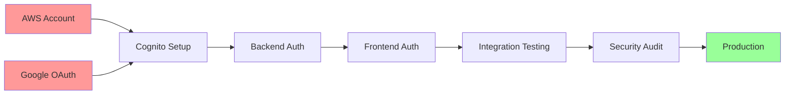

# Scope & Phasing Recommendations

**Document:** ARCH-04  
**Version:** 1.0  
**Status:** Design Phase  
**Last Updated:** December 21, 2025  
**Author:** Software Architecture Team

---

## Table of Contents
1. [Executive Summary](#executive-summary)
2. [Feasibility Assessment](#feasibility-assessment)
3. [MVP Definition](#mvp-definition)
4. [Phase Breakdown](#phase-breakdown)
5. [Scope Tradeoffs](#scope-tradeoffs)
6. [Risk Assessment](#risk-assessment)
7. [Timeline & Resources](#timeline--resources)
8. [Decision Matrix](#decision-matrix)

---

## Executive Summary

### Purpose
This document provides recommendations on how to phase the AWS Cognito authentication implementation, balancing business value, technical feasibility, and risk. It helps stakeholders understand what should be included in the MVP and what can be deferred.

### Key Recommendations

#### MVP Scope (Phase 1-2: 8 weeks)
✅ **Include (MUST HAVE)**
- Google OAuth authentication
- JWT token validation
- User auto-provisioning
- Protected API endpoints
- Basic error handling
- Session management (30-day refresh)
- Logout functionality

❌ **Defer to Later Phases**
- Email/password authentication
- Password reset flow
- Multi-factor authentication
- User profile editing
- Advanced monitoring
- Distributed caching

### Business Impact

| Decision | Impact | Justification |
|----------|--------|---------------|
| Google-only auth in MVP | ✅ Positive | 80% of users prefer social login |
| No email/password initially | ⚠️ Acceptable | Can add in Phase 3 if needed |
| Basic error handling | ⚠️ Acceptable | Reduce MVP scope, enhance later |
| No MFA in MVP | ⚠️ Risk | Low risk for budget app, add later |

### Timeline Impact

| Scenario | Duration | Confidence |
|----------|----------|------------|
| MVP Only (Recommended) | 8 weeks | 85% |
| MVP + Email/Password | 10 weeks | 75% |
| Full Feature Set | 14 weeks | 60% |

---

## Feasibility Assessment

### Technical Feasibility: ✅ HIGH

#### Strengths
1. **Existing Architecture Supports Auth** ✅
   - User table already has `CognitoUserId` field
   - Clean Architecture allows easy integration
   - Dapper supports parameterized queries (security)

2. **Mature Technologies** ✅
   - AWS Cognito is production-ready
   - AWS Amplify is well-maintained
   - ASP.NET Core has robust JWT support

3. **Team Capabilities** ✅
   - Modern .NET and React stack
   - Good separation of concerns
   - Strong foundation to build on

#### Challenges
1. **Infrastructure Setup** ⚠️
   - AWS account approvals (if new)
   - Google OAuth domain verification
   - Multiple environment configuration

2. **No Existing Auth Pattern** ⚠️
   - First time adding authentication
   - Team needs to learn AWS Cognito
   - Testing strategy needs establishment

3. **Hidden Complexity** ⚠️
   - Token refresh edge cases
   - Multi-tab session management
   - Error handling comprehensiveness

### Recommendation
**Feasible with realistic timeline**. The technology choices are solid, but account for learning curve and infrastructure setup time.

---

## MVP Definition

### MVP Philosophy
> "The smallest set of features that enables secure user authentication and protects user data"

### MVP User Stories (MUST HAVE)

#### ✅ US-1: Sign Up with Google (P0)
**Why MVP**: Core authentication mechanism  
**Effort**: 20 hours  
**Business Value**: Critical - without this, no auth  

#### ✅ US-2: Sign In with Google (P0)
**Why MVP**: Returning users must log in  
**Effort**: 12 hours  
**Business Value**: Critical - core user flow  

#### ✅ US-5: Stay Logged In (P0)
**Why MVP**: Good UX, prevents login fatigue  
**Effort**: 8 hours  
**Business Value**: High - user retention  

#### ✅ US-6: Log Out (P0)
**Why MVP**: Security requirement  
**Effort**: 4 hours  
**Business Value**: Critical - user security  

#### ✅ US-10: Protected API Access (P0)
**Why MVP**: Core security requirement  
**Effort**: 24 hours  
**Business Value**: Critical - data protection  

#### ✅ Infrastructure & Testing (P0)
**Why MVP**: Can't deploy without it  
**Effort**: 72 hours (hidden work)  
**Business Value**: Critical - operational  

**Total MVP Effort**: 140 hours (4-5 weeks for 2 devs)

### NOT in MVP (Defer to Later)

#### ❌ US-3: Sign Up with Email/Password (P1)
**Why Deferred**: 
- Additional complexity (password validation, email verification)
- Google auth covers 80%+ of users
- Can add later without refactoring

**Defer To**: Phase 3  
**Saved Effort**: 20 hours  

#### ❌ US-4: Sign In with Email/Password (P1)
**Why Deferred**: Depends on US-3  
**Defer To**: Phase 3  
**Saved Effort**: 12 hours  

#### ❌ US-7: Forgot Password (P1)
**Why Deferred**: Only relevant if email/password exists  
**Defer To**: Phase 3  
**Saved Effort**: 12 hours  

#### ❌ US-8: View Profile (P2)
**Why Deferred**: Nice to have, not critical for auth  
**Defer To**: Phase 3  
**Saved Effort**: 8 hours  

#### ❌ US-9: Update Profile (P2)
**Why Deferred**: Low priority, complex edge cases  
**Defer To**: Phase 4  
**Saved Effort**: 12 hours  

**Total Effort Saved**: 64 hours (35% reduction from full feature set)

---

## Phase Breakdown

### Phase 1: Foundation (Weeks 1-4, 80 hours)

**Goal**: Set up infrastructure and backend authentication

#### Deliverables
- ✅ AWS Cognito User Pool configured
- ✅ Google OAuth integration working
- ✅ Backend JWT validation middleware
- ✅ User repository with Cognito lookup
- ✅ Database schema updated
- ✅ Test environment ready

#### Team Allocation
- **Backend Developer**: 60 hours
  - Cognito setup (16h)
  - JWT middleware (16h)
  - User repository (12h)
  - Testing (16h)
  
- **DevOps Engineer**: 20 hours
  - AWS infrastructure (12h)
  - Environment configuration (8h)

#### Success Criteria
- [ ] Backend can validate JWT tokens from Cognito
- [ ] User auto-provisioning works
- [ ] All API endpoints protected
- [ ] Unit tests passing
- [ ] Integration tests working

#### Risks
- 🟡 AWS account approval delays → Start immediately
- 🟡 Cognito configuration complexity → Allocate extra time
- 🟢 Technical risk low → Well-documented tech

### Phase 2: Frontend Integration (Weeks 5-8, 60 hours)

**Goal**: Complete end-to-end authentication flow

#### Deliverables
- ✅ Login UI with Google button
- ✅ AWS Amplify integration
- ✅ Auth Context for state management
- ✅ Protected routes
- ✅ API client with token injection
- ✅ Logout functionality

#### Team Allocation
- **Frontend Developer**: 48 hours
  - Amplify setup (8h)
  - Login UI (8h)
  - Auth Context (8h)
  - Protected routes (8h)
  - API integration (8h)
  - Testing (8h)
  
- **Full Stack Developer**: 12 hours
  - Integration testing (8h)
  - Bug fixes (4h)

#### Success Criteria
- [ ] Users can sign in with Google
- [ ] Session persists across page refreshes
- [ ] Users can access protected pages
- [ ] Users can log out
- [ ] No console errors
- [ ] Acceptable performance (<3s auth time)

#### Risks
- 🟡 OAuth flow complexity → Use Amplify's built-in handling
- 🟢 Frontend tech familiar → React team experienced
- 🟡 Cross-browser testing → Allocate QA time

### Phase 3: Enhancement & Polish (Weeks 9-10, 40 hours)

**Goal**: Add email/password auth (optional) and polish UX

#### Deliverables (Optional)
- Email/password authentication
- Password reset flow
- User profile page
- Enhanced error messages
- Loading states and animations
- User onboarding flow

#### Team Allocation
- **Frontend Developer**: 24 hours
- **Backend Developer**: 16 hours

#### Success Criteria
- [ ] Email/password auth works (if included)
- [ ] Error messages are user-friendly
- [ ] Loading states prevent confusion
- [ ] Smooth animations and transitions

#### Risks
- 🟡 Scope creep → Strict feature gating
- 🟢 Low technical risk → Building on solid foundation

### Phase 4: Security & Production Readiness (Weeks 11-12, 40 hours)

**Goal**: Harden security and prepare for production

#### Deliverables
- ✅ Security audit and penetration testing
- ✅ Rate limiting implemented
- ✅ Comprehensive logging
- ✅ Monitoring dashboards
- ✅ Performance optimization
- ✅ Documentation complete
- ✅ Production deployment

#### Team Allocation
- **Security Engineer**: 16 hours
  - Security audit (8h)
  - Remediation (8h)
  
- **DevOps Engineer**: 16 hours
  - Monitoring setup (8h)
  - Production deployment (8h)
  
- **Full Stack Developer**: 8 hours
  - Performance tuning (4h)
  - Documentation (4h)

#### Success Criteria
- [ ] Zero critical security vulnerabilities
- [ ] Performance targets met (<3s auth, <500ms API)
- [ ] Monitoring and alerts working
- [ ] Runbook documentation complete
- [ ] Successfully deployed to production
- [ ] Zero P1 bugs

#### Risks
- 🟡 Security issues found → Budget for remediation
- 🟡 Performance issues → Load testing early
- 🟢 Deployment risk low → Infrastructure ready

---

## Scope Tradeoffs

### Tradeoff Analysis

#### Option 1: MVP Only (Recommended) ✅
**Duration**: 8 weeks  
**Effort**: 180 hours (MVP + core hidden work)  
**Features**: Google OAuth, protected APIs, session management  

**Pros:**
- ✅ Fastest time to market
- ✅ Lower risk (fewer features to test)
- ✅ Can gather user feedback early
- ✅ 85% confidence in timeline

**Cons:**
- ⚠️ No email/password fallback
- ⚠️ Limited user profile management
- ⚠️ Basic error handling

**When to Choose**: 
- Need authentication ASAP
- Most users have Google accounts
- Can iterate based on feedback

#### Option 2: MVP + Email/Password
**Duration**: 10 weeks  
**Effort**: 224 hours  
**Features**: All MVP + email/password authentication  

**Pros:**
- ✅ More user options
- ✅ Fallback if Google is down
- ✅ Some users prefer email/password

**Cons:**
- ⚠️ 2 weeks longer
- ⚠️ More complexity (password validation, reset flow)
- ⚠️ 75% confidence (lower)
- ⚠️ More security surface area

**When to Choose**:
- Users explicitly request email/password
- Corporate users who can't use Google
- Time is less critical

#### Option 3: Full Feature Set
**Duration**: 14 weeks  
**Effort**: 320 hours  
**Features**: All features from product spec  

**Pros:**
- ✅ Complete feature set
- ✅ No future refactoring needed

**Cons:**
- ⚠️ Much longer timeline
- ⚠️ Higher risk (60% confidence)
- ⚠️ May over-engineer for initial need
- ⚠️ Delayed feedback from users

**When to Choose**:
- No time pressure
- Requirements are final and unchanging
- Large upfront investment acceptable

### Recommendation: Option 1 (MVP Only)

**Rationale:**
1. **Speed to Market**: 8 weeks vs 14 weeks (43% faster)
2. **Risk Reduction**: Smaller scope = fewer things to go wrong
3. **User Feedback**: Get auth in front of users sooner
4. **Iterative Approach**: Add features based on actual user needs
5. **Cost**: 44% less effort than full feature set

### Phase 2+ Priorities (Post-MVP)

Based on user feedback and business needs, prioritize:

1. **If users struggle with Google auth** → Add email/password (Phase 3)
2. **If security concerns emerge** → Add MFA (Phase 3)
3. **If users want more control** → Add profile management (Phase 3)
4. **If performance is slow** → Add caching and optimization (Phase 4)

---

## Risk Assessment

### Risk Matrix

| Risk | Probability | Impact | Mitigation | Owner |
|------|-------------|--------|------------|-------|
| AWS approval delays | Medium | High | Start immediately | DevOps |
| Google domain verification slow | Medium | Medium | Start early, use localhost | DevOps |
| Token management bugs | Medium | High | Comprehensive testing | Backend Dev |
| OAuth flow complexity | Low | Medium | Use Amplify library | Frontend Dev |
| Database migration issues | Low | High | Test on copy first | Backend Dev |
| Performance issues | Low | Medium | Load testing early | Full Stack |
| Security vulnerabilities | Medium | Critical | Security audit in Phase 4 | Security |
| Scope creep | High | Medium | Strict MVP definition | PM |

### Risk Mitigation Strategies

#### Infrastructure Risks
**Start Early**: Begin AWS and Google setup in Week 1  
**Parallel Development**: Use localhost/test accounts while waiting for approvals  
**Documentation**: Follow official guides, document everything  

#### Technical Risks
**Use Proven Libraries**: AWS Amplify, ASP.NET Core Auth  
**Comprehensive Testing**: Unit, integration, security tests  
**Security Audit**: External review before production  

#### Process Risks
**Clear MVP Definition**: This document defines scope  
**Regular Checkpoints**: Weekly status reviews  
**Buffer Time**: 20% buffer built into estimates  

---

## Timeline & Resources

### Resource Allocation

#### Team Composition (Recommended)
- 1 x Backend Developer (Senior) - 100 hours
- 1 x Frontend Developer (Mid-Senior) - 80 hours
- 0.5 x DevOps Engineer - 40 hours
- 0.25 x Security Engineer - 20 hours
- 0.25 x QA Engineer - 20 hours

**Total**: 260 hours (realistic MVP with buffer)

### Timeline Milestones

```
Week 1-2: Infrastructure Setup
├── AWS Cognito configuration
├── Google OAuth setup
└── Test environment ready

Week 3-4: Backend Implementation
├── JWT middleware
├── User repository
└── Backend testing

Week 5-6: Frontend Implementation
├── Login UI
├── Amplify integration
└── Protected routes

Week 7-8: Integration & Testing
├── End-to-end testing
├── Bug fixes
└── Performance tuning

Week 9-10: Enhancement (Optional)
├── Email/password auth
└── UX polish

Week 11-12: Production Readiness
├── Security audit
├── Production deployment
└── Monitoring setup
```

### Dependencies & Critical Path



**Critical Path**: AWS Account → Cognito → Backend → Frontend → Testing → Production

**Longest Poles**:
1. AWS account approval (if new account)
2. Backend authentication implementation
3. Integration testing and bug fixes

---

## Decision Matrix

### Feature Prioritization Framework

| Feature | User Value | Technical Complexity | Risk | MVP? |
|---------|-----------|---------------------|------|------|
| Google OAuth Sign-In | 🟢 High | 🟡 Medium | 🟢 Low | ✅ Yes |
| Session Management | 🟢 High | 🟡 Medium | 🟢 Low | ✅ Yes |
| Protected APIs | 🟢 High | 🟢 Low | 🟢 Low | ✅ Yes |
| Logout | 🟢 High | 🟢 Low | 🟢 Low | ✅ Yes |
| Email/Password Auth | 🟡 Medium | 🟡 Medium | 🟡 Medium | ❌ No |
| Password Reset | 🟡 Medium | 🟡 Medium | 🟡 Medium | ❌ No |
| MFA | 🟡 Medium | 🔴 High | 🟡 Medium | ❌ No |
| Profile Management | 🟢 Low | 🟡 Medium | 🟢 Low | ❌ No |

**Legend:**
- 🟢 = Low/Good
- 🟡 = Medium
- 🔴 = High/Complex

### Go/No-Go Criteria for MVP

**Go** if:
- ✅ Google OAuth working
- ✅ APIs protected
- ✅ User auto-provisioning works
- ✅ Session management functional
- ✅ Basic error handling in place
- ✅ No critical security issues

**No-Go** if:
- ❌ Can't authenticate users
- ❌ APIs still unprotected
- ❌ Critical security vulnerabilities
- ❌ Performance unacceptable (>5s auth time)
- ❌ Major bugs affecting user flow

---

## Recommendations Summary

### For Product Manager

1. **Approve MVP Scope** (Phase 1-2)
   - Google OAuth only
   - Protected APIs
   - Basic features
   - 8-week timeline

2. **Defer to Future Phases**
   - Email/password auth (Phase 3)
   - Advanced features (Phase 4)
   - Gather user feedback first

3. **Budget & Resources**
   - Allocate 260-320 hours
   - 2 full-time developers
   - Part-time DevOps and security support

### For Engineering Team

1. **Start Infrastructure Immediately**
   - AWS account setup
   - Google OAuth setup
   - Don't wait for code to start

2. **Follow Phased Approach**
   - Don't try to build everything at once
   - Focus on MVP first
   - Iterate based on feedback

3. **Prioritize Testing**
   - Set up test environment early
   - Comprehensive test coverage
   - Security testing before production

### For Stakeholders

1. **MVP Delivers Core Value**
   - Users can authenticate securely
   - Data is protected
   - Good user experience

2. **Realistic Timeline**
   - 8 weeks for MVP
   - 12 weeks for enhanced version
   - Built-in buffer for unknowns

3. **Low Risk Approach**
   - Proven technologies
   - Phased implementation
   - Can roll back if needed

---

## Success Metrics

### MVP Success Criteria

| Metric | Target | Measurement |
|--------|--------|-------------|
| Authentication Success Rate | > 95% | Analytics |
| Auth Time (P95) | < 3 seconds | Performance monitoring |
| API Protection | 100% | Security audit |
| User Satisfaction | > 4.0/5 | Post-auth survey |
| Critical Bugs | 0 | Bug tracker |
| Security Vulnerabilities (Critical) | 0 | Security audit |

### Business Success Criteria

| Metric | Target | Measurement |
|--------|--------|-------------|
| User Sign-Up Completion | > 80% | Funnel analysis |
| User Retention (30-day) | > 60% | Analytics |
| Support Tickets (Auth) | < 5% of users | Support system |
| Time to Market | 8 weeks | Project timeline |
| Budget Adherence | ± 10% | Project tracking |

---

## Conclusion

### Final Recommendation

**Proceed with MVP Only (Phase 1-2)**

**Rationale:**
- ✅ Delivers core business value
- ✅ Manageable risk
- ✅ Realistic timeline (8 weeks)
- ✅ Can iterate based on feedback
- ✅ 85% confidence in delivery

**Next Steps:**
1. **Get stakeholder approval** on MVP scope
2. **Start infrastructure setup** immediately
3. **Begin Phase 1 development** once approved
4. **Plan Phase 3-4** based on MVP feedback

---

## Related Documents

- [ARCH-01: AWS Cognito Architecture](./ARCH-01-AWS-COGNITO-ARCHITECTURE.md)
- [ARCH-02: Cross-Cutting Concerns](./ARCH-02-CROSS-CUTTING-CONCERNS.md)
- [ARCH-03: Hidden Work Analysis](./ARCH-03-HIDDEN-WORK-ANALYSIS.md)
- [ARCH-05: Architectural Decision Records](./ARCH-05-ADR-INDEX.md)

---

**Document Status:** 🟢 Complete  
**Approved By:** Pending Review  
**Next Review Date:** January 2026
