# AWS Cognito Authentication - Architecture Diagrams

**Document:** ARCH-10  
**Version:** 1.0  
**Status:** Complete  
**Last Updated:** December 21, 2025  
**Author:** Software Architecture Team

---

## Table of Contents
1. [System Context](#system-context)
2. [Authentication Flows](#authentication-flows)
3. [Component Architecture](#component-architecture)
4. [Data Flow Diagrams](#data-flow-diagrams)
5. [Deployment Architecture](#deployment-architecture)
6. [Error Handling Flows](#error-handling-flows)

---

## System Context

### High-Level System Architecture


---

## Authentication Flows

### 1. First-Time User Sign-Up Flow


### 2. Returning User Sign-In Flow


### 3. Auto-Login on Page Refresh


### 4. Token Refresh Flow (Background)


### 5. Logout Flow


---

## Component Architecture

### Frontend Component Structure


### Backend Component Structure


---

## Data Flow Diagrams

### API Request with Authentication


### User Auto-Provisioning Flow


---

## Deployment Architecture

### Development Environment


### Production Environment (Azure)


---

## Error Handling Flows

### Authentication Error Handling


### Token Expiration Handling


---

## Clean Architecture View

### Layer Dependencies with Authentication

```mermaid
graph TB
    subgraph "Presentation Layer"
        React[React SPA<br/>• Auth Context<br/>• Protected Routes<br/>• Login UI]
        Server[ASP.NET Server<br/>• JWT Middleware<br/>• Auth Endpoints]
    end
    
    subgraph "Application Layer"
        IUserRepo[IUserRepository<br/>GetByCognitoUserIdAsync]
        IExpenseRepo[IExpenseRepository<br/>GetByUserIdAsync]
    end
    
    subgraph "Domain Layer"
        User[User Entity<br/>• Id<br/>• CognitoUserId<br/>• Email]
        Expense[Expense Entity<br/>• Id<br/>• UserId<br/>• Amount]
    end
    
    subgraph "Infrastructure Layer"
        UserRepo[UserRepository<br/>Dapper + SQL]
        ExpenseRepo[ExpenseRepository<br/>Dapper + SQL]
    end
    
    React -->|HTTP| Server
    Server --> IUserRepo
    Server --> IExpenseRepo
    
    IUserRepo --> User
    IExpenseRepo --> Expense
    
    UserRepo -.->|Implements| IUserRepo
    ExpenseRepo -.->|Implements| IExpenseRepo
    
    Server --> UserRepo
    Server --> ExpenseRepo
    
    style User fill:#4caf50
    style IUserRepo fill:#2196f3
    style UserRepo fill:#ff9800
    style Server fill:#9c27b0
    style React fill:#61dafb
```



---

## Security Architecture

### JWT Token Validation Flow


### Data Isolation Pattern

```mermaid
flowchart TD
    Start[API Request arrives] --> ExtractUser[Extract user from JWT claims]
    ExtractUser --> LookupDB[Look up user in database]
    
    LookupDB --> UserExists{User exists?}
    UserExists -->|No| CreateUser[Auto-provision user]
    CreateUser --> FilterData
    
    UserExists -->|Yes| FilterData[Filter data by UserId]
    FilterData --> ExecuteQuery[Execute query with UserId filter]
    ExecuteQuery --> ReturnData[Return only user's data]
    
    ReturnData --> End[End]
    
    Note right of FilterData: All queries MUST filter by UserId<br/>Users can ONLY see their own data
    
    style FilterData fill:#4caf50
    style ReturnData fill:#2196f3
```

---

## Key Takeaways

### Architecture Strengths

✅ **Security First**
- JWT tokens validated on every request
- Data isolation by UserId
- Industry-standard OAuth 2.0

✅ **Scalability**
- Stateless API design
- Managed services (Cognito, Azure/AWS)
- Horizontal scaling ready

✅ **User Experience**
- Seamless authentication
- Automatic token refresh
- Persistent sessions

✅ **Maintainability**
- Clean Architecture preserved
- Well-defined components
- Clear separation of concerns

### Critical Flows

1. **Authentication**: Google OAuth → Cognito → JWT → API
2. **Authorization**: JWT validation → User lookup → Data filtering
3. **Token Management**: Amplify handles refresh automatically
4. **Error Handling**: Graceful degradation, user-friendly messages

---

## Related Documents

- [ARCH-01: AWS Cognito Architecture](./ARCH-01-AWS-COGNITO-ARCHITECTURE.md)
- [ARCH-02: Cross-Cutting Concerns](./ARCH-02-CROSS-CUTTING-CONCERNS.md)
- [ARCH-04: Scope & Phasing](./ARCH-04-SCOPE-PHASING.md)
- [ARCH-05: ADRs](./ARCH-05-ADR-INDEX.md)

---

**Document Status:** 🟢 Complete  
**Approved By:** Pending Review  
**Next Review Date:** January 2026
