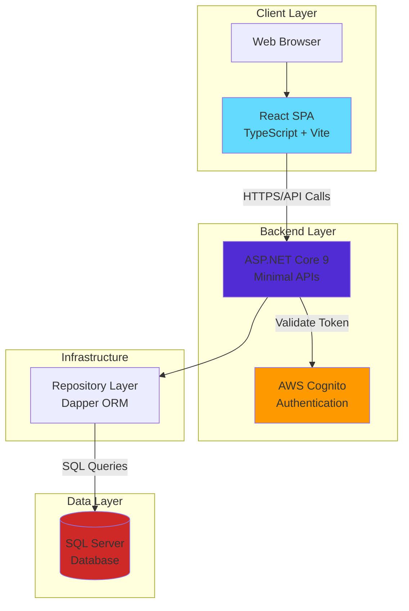
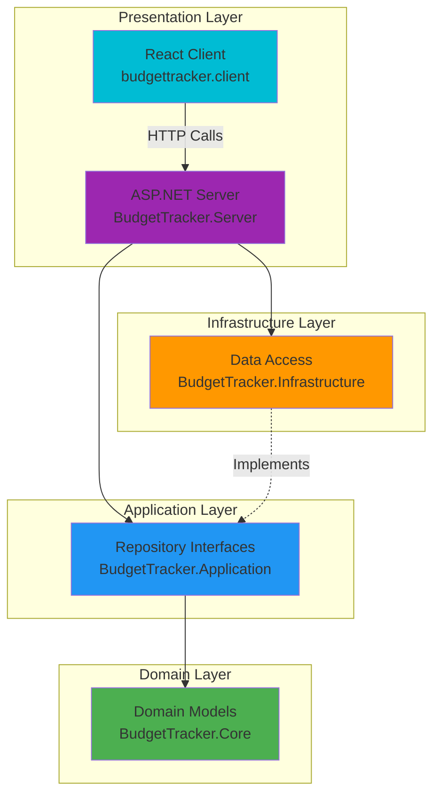
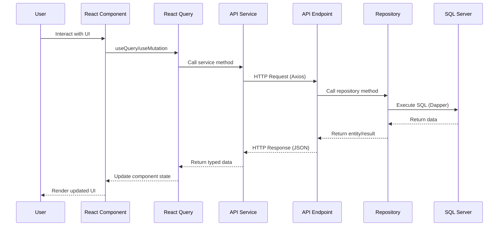
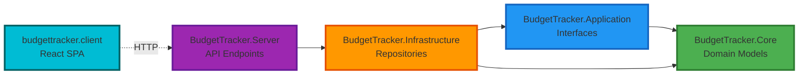
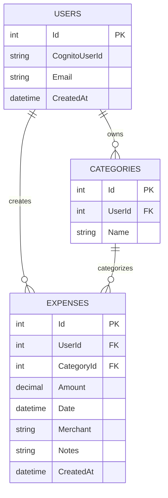
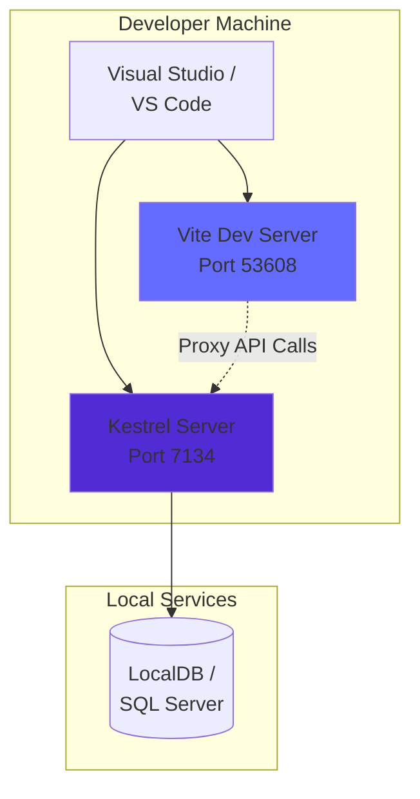
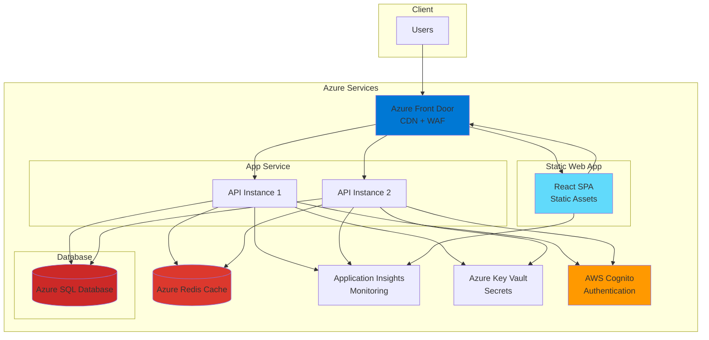
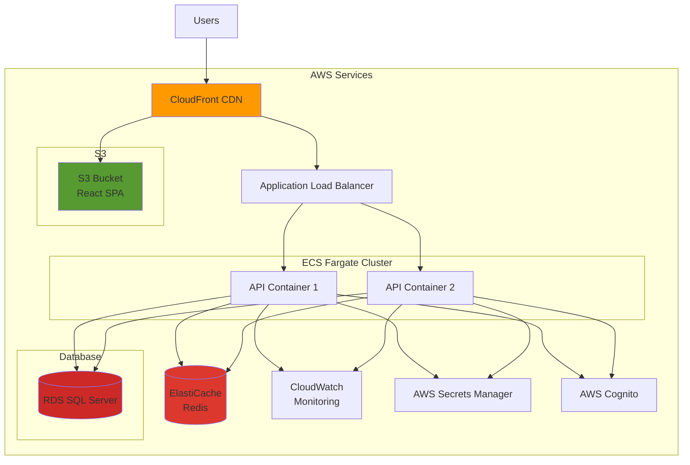

# BudgetTracker - Architecture Documentation

## Table of Contents
1. [System Overview](#system-overview)
2. [Technology Stack](#technology-stack)
3. [Architecture Pattern](#architecture-pattern)
4. [Project Structure](#project-structure)
5. [Data Flow](#data-flow)
6. [Architecture Diagrams](#architecture-diagrams)
7. [Key Design Decisions](#key-design-decisions)
8. [Current Architecture Strengths](#current-architecture-strengths)
9. [Recommended Improvements](#recommended-improvements)
10. [Deployment Architecture](#deployment-architecture)
11. [Security Considerations](#security-considerations)
12. [Scalability Considerations](#scalability-considerations)

---

## System Overview

BudgetTracker is a full-stack web application designed to help users track their expenses and manage their budget. The application follows Clean Architecture principles with a clear separation of concerns across multiple layers.

**Core Features:**
- User management with AWS Cognito integration (planned)
- Expense tracking with categories
- Budget visualization and reporting
- RESTful API for data operations

---

## Technology Stack

### Frontend
- **Framework**: React 19.1.1
- **Language**: TypeScript 5.9.3
- **Build Tool**: Vite 5.4.11
- **State Management**: TanStack Query (React Query) 5.90.12
- **UI Framework**: Material UI 7.3.6
- **Styling**: Tailwind CSS 3.4.18 + Emotion
- **HTTP Client**: Axios 1.13.2
- **Routing**: React Router DOM 7.10.1
- **Date Handling**: date-fns 4.1.0
- **Icons**: Lucide React 0.556.0

### Backend
- **Framework**: ASP.NET Core 9.0
- **Language**: C# with .NET 9.0
- **API Style**: Minimal APIs
- **ORM**: Dapper 2.1.66
- **Database**: Microsoft SQL Server
- **Database Client**: Microsoft.Data.SqlClient 6.1.3
- **DI Enhancement**: Scrutor 6.1.0 (Assembly scanning)
- **API Documentation**: OpenAPI/Swagger (Microsoft.AspNetCore.OpenApi)

### Development Environment
- **SPA Proxy**: Integrated ASP.NET Core SPA proxy for development
- **HTTPS**: Development certificates via dotnet dev-certs
- **Linting**: ESLint 9.36.0

---

## Architecture Pattern

The application implements **Clean Architecture** (also known as Onion Architecture or Hexagonal Architecture), which emphasizes:
- Dependency inversion
- Separation of concerns
- Testability
- Framework independence of business logic

### Layer Overview

```
┌─────────────────────────────────────────────────────┐
│                    Presentation                     │
│        (BudgetTracker.Server + React Client)        │
├─────────────────────────────────────────────────────┤
│                    Application                      │
│           (BudgetTracker.Application)               │
│              - Interfaces/Contracts                 │
├─────────────────────────────────────────────────────┤
│                       Core                          │
│              (BudgetTracker.Core)                   │
│               - Domain Models                       │
├─────────────────────────────────────────────────────┤
│                  Infrastructure                     │
│          (BudgetTracker.Infrastructure)             │
│          - Data Access Implementation               │
└─────────────────────────────────────────────────────┘
```

---

## Project Structure

### Backend Projects

#### 1. BudgetTracker.Core
**Purpose**: Domain layer containing business entities and core domain logic  
**Dependencies**: None (completely independent)  
**Contents**:
- `Models/` - Domain entities (User, Category, Expense)

**Key Characteristics**:
- No external dependencies
- Pure POCOs (Plain Old CLR Objects)
- Contains only business rules and entities

#### 2. BudgetTracker.Application
**Purpose**: Application layer defining contracts and use case interfaces  
**Dependencies**: BudgetTracker.Core  
**Contents**:
- `Interfaces/` - Repository interfaces (IExpenseRepository, ICategoryRepository, IUserRepository)

**Key Characteristics**:
- Defines abstractions for infrastructure
- No implementation details
- Enables dependency inversion

#### 3. BudgetTracker.Infrastructure
**Purpose**: Infrastructure layer implementing data access and external integrations  
**Dependencies**: BudgetTracker.Application, BudgetTracker.Core  
**NuGet Packages**:
- Dapper (micro-ORM)
- Microsoft.Data.SqlClient
- Microsoft.Extensions.Configuration

**Contents**:
- `Data/DapperContext.cs` - Database connection factory
- `Repositories/` - Repository implementations

**Key Characteristics**:
- Implements Application layer interfaces
- Direct SQL queries via Dapper
- Connection management

#### 4. BudgetTracker.Server
**Purpose**: API and presentation layer  
**Dependencies**: BudgetTracker.Infrastructure  
**NuGet Packages**:
- Microsoft.AspNetCore.OpenApi
- Microsoft.AspNetCore.SpaProxy
- Scrutor (for assembly scanning)
- Dapper, Microsoft.Data.SqlClient (transitive)

**Contents**:
- `Program.cs` - Application entry point and DI configuration
- `Endpoints/` - Minimal API endpoint definitions
- `appsettings.json` - Configuration

**Key Characteristics**:
- Minimal APIs (no controllers)
- Endpoint routing with groups
- SPA integration
- OpenAPI/Swagger documentation

### Frontend Project

#### budgettracker.client
**Purpose**: Single Page Application (SPA) for user interface  
**Structure**:
```
src/
├── components/      # React components
│   └── Dashboard.tsx
├── services/        # API service layer
│   └── api.service.ts
├── types/          # TypeScript type definitions
│   └── api.ts
├── lib/            # Utility libraries
│   └── api.ts      # Axios instance
├── assets/         # Static assets
├── App.tsx         # Root component
└── main.tsx        # Application entry point
```

**Key Characteristics**:
- Component-based architecture
- Service layer for API calls
- Type-safe with TypeScript
- React Query for server state management
- Material UI components with Tailwind utility classes

---

## Data Flow

### Request Flow (Frontend to Backend)

```
User Interaction
      ↓
React Component
      ↓
TanStack Query (useQuery/useMutation)
      ↓
API Service (api.service.ts)
      ↓
Axios HTTP Client
      ↓
[HTTP Request] → Vite Dev Proxy (Dev) or Direct (Prod)
      ↓
ASP.NET Core Middleware Pipeline
      ↓
Minimal API Endpoint
      ↓
Repository Interface (IRepository)
      ↓
Repository Implementation
      ↓
Dapper (SQL Query Execution)
      ↓
SQL Server Database
      ↓
[Response follows reverse path]
```

### Dependency Flow (Clean Architecture)

```
Infrastructure → Application → Core
        ↑              ↑
    Server      (Depends On)
```

**Important**: Dependencies only flow inward. Core has no dependencies, Application depends on Core, Infrastructure depends on Application, and Server depends on Infrastructure.

---

## Architecture Diagrams

### 1. High-Level System Architecture



### 2. Clean Architecture Layers



### 3. Detailed Data Flow Diagram



### 4. Project Dependencies



### 5. Database Schema (Current)



---

## Key Design Decisions

### 1. Minimal APIs vs Controllers
**Decision**: Use Minimal APIs  
**Rationale**:
- Reduced boilerplate code
- Better performance (less abstraction layers)
- Modern .NET approach
- Suitable for microservices architecture
- Easier to understand for simple CRUD operations

### 2. Dapper vs Entity Framework
**Decision**: Use Dapper  
**Rationale**:
- Lightweight and fast (micro-ORM)
- Direct SQL control
- Better performance for read-heavy operations
- Less overhead than EF Core
- Simpler for straightforward CRUD scenarios

**Trade-off**: Lose change tracking, migrations, and LINQ query capabilities

### 3. React Query for State Management
**Decision**: Use TanStack Query instead of Redux/Context  
**Rationale**:
- Excellent for server state management
- Built-in caching, refetching, and synchronization
- Reduces boilerplate significantly
- Handles loading and error states automatically
- Optimistic updates support

### 4. Scrutor for Assembly Scanning
**Decision**: Use Scrutor for automatic DI registration  
**Rationale**:
- Eliminates manual registration of repositories
- Convention-based registration (e.g., *Repository pattern)
- Reduces Program.cs complexity
- Easier to add new repositories

### 5. Separate Frontend and Backend Projects
**Decision**: Keep React client separate from Server project  
**Rationale**:
- Independent deployment capabilities
- Technology flexibility
- Better developer experience (HMR in dev)
- Clear separation of concerns
- Can serve from CDN in production

---

## Current Architecture Strengths

### ✅ Well-Implemented Aspects

1. **Clean Architecture Implementation**
   - Proper dependency flow (inward only)
   - Clear separation of concerns
   - Domain models isolated from infrastructure

2. **Repository Pattern**
   - Abstraction over data access
   - Testability (can mock repositories)
   - Consistent interface for data operations

3. **Modern Tech Stack**
   - Latest .NET 9.0 and React 19
   - TypeScript for type safety
   - Modern tooling (Vite, TanStack Query)

4. **API Organization**
   - Grouped endpoints by resource
   - Consistent RESTful design
   - Clear endpoint structure

5. **Frontend Architecture**
   - Component-based design
   - Service layer for API calls
   - Type-safe API contracts
   - Proper state management with React Query

6. **Development Experience**
   - SPA proxy for seamless dev workflow
   - Hot module replacement (HMR)
   - HTTPS in development
   - TypeScript compilation checks

---

## Recommended Improvements

### 🔴 High Priority (Critical)

#### 1. Authentication & Authorization
**Current State**: No authentication implemented (commented out in Program.cs)  
**Recommendation**:
```csharp
// Add AWS Cognito authentication
builder.Services.AddAuthentication(JwtBearerDefaults.AuthenticationScheme)
    .AddJwtBearer(options =>
    {
        options.Authority = builder.Configuration["Cognito:Authority"];
        options.Audience = builder.Configuration["Cognito:ClientId"];
    });

// Enable authorization on API endpoints
apiGroup.RequireAuthorization();
```

**Why**: Security is critical. APIs are currently open to anyone.

#### 2. Error Handling & Logging
**Current State**: No centralized error handling or structured logging  
**Recommendation**:
- Add global exception handler middleware
- Implement structured logging (Serilog or built-in ILogger)
- Add correlation IDs for request tracking
- Implement proper error response models

```csharp
// Add global exception handler
app.UseExceptionHandler("/error");

// Structured logging
builder.Services.AddLogging(logging =>
{
    logging.AddConsole();
    logging.AddDebug();
    logging.AddApplicationInsights(); // For Azure
});
```

#### 3. Input Validation
**Current State**: No validation layer  
**Recommendation**:
- Add FluentValidation for request validation
- Implement validation filters for endpoints
- Return consistent validation error responses

```csharp
// Example with FluentValidation
builder.Services.AddValidatorsFromAssemblyContaining<ExpenseValidator>();
builder.Services.AddEndpointFilter<ValidationFilter>();
```

#### 4. CORS Configuration
**Current State**: No CORS policy configured  
**Recommendation**:
```csharp
builder.Services.AddCors(options =>
{
    options.AddPolicy("AllowFrontend", policy =>
    {
        policy.WithOrigins(builder.Configuration["Frontend:Url"])
              .AllowAnyMethod()
              .AllowAnyHeader()
              .AllowCredentials();
    });
});

app.UseCors("AllowFrontend");
```

### 🟡 Medium Priority (Important)

#### 5. API Versioning
**Recommendation**: Add API versioning for future flexibility
```csharp
builder.Services.AddApiVersioning(options =>
{
    options.DefaultApiVersion = new ApiVersion(1, 0);
    options.AssumeDefaultVersionWhenUnspecified = true;
    options.ReportApiVersions = true;
});

// Usage: /api/v1/expenses
```

#### 6. Health Checks
**Recommendation**: Add health check endpoints for monitoring
```csharp
builder.Services.AddHealthChecks()
    .AddSqlServer(connectionString)
    .AddCheck("self", () => HealthCheckResult.Healthy());

app.MapHealthChecks("/health");
```

#### 7. Response Caching
**Recommendation**: Implement caching strategy
```csharp
builder.Services.AddResponseCaching();
builder.Services.AddMemoryCache();

// For Redis distributed cache
builder.Services.AddStackExchangeRedisCache(options =>
{
    options.Configuration = builder.Configuration["Redis:Connection"];
});
```

#### 8. Rate Limiting
**Recommendation**: Add rate limiting to prevent abuse
```csharp
builder.Services.AddRateLimiter(options =>
{
    options.AddFixedWindowLimiter("api", opt =>
    {
        opt.Window = TimeSpan.FromMinutes(1);
        opt.PermitLimit = 100;
    });
});
```

#### 9. API Documentation Enhancement
**Recommendation**: Configure Swagger UI for better API exploration
```csharp
if (app.Environment.IsDevelopment())
{
    app.MapOpenApi();
    app.UseSwaggerUI(options =>
    {
        options.SwaggerEndpoint("/openapi/v1.json", "BudgetTracker API V1");
    });
}
```

#### 10. Request/Response DTOs
**Current State**: Using domain entities directly in API  
**Recommendation**: Create separate DTOs to:
- Prevent over-posting vulnerabilities
- Control what data is exposed
- Allow different representations for different endpoints

```csharp
public record CreateExpenseRequest(
    int UserId,
    int CategoryId,
    decimal Amount,
    DateTime Date,
    string? Merchant,
    string? Notes
);

public record ExpenseResponse(
    int Id,
    int UserId,
    int CategoryId,
    decimal Amount,
    DateTime Date,
    string? Merchant,
    string? Notes,
    DateTime CreatedAt
);
```

### 🟢 Low Priority (Nice to Have)

#### 11. Unit Testing
**Recommendation**: Add comprehensive test coverage
- Unit tests for repositories
- Integration tests for API endpoints
- Frontend component tests

```
BudgetTracker.Tests/
├── Unit/
│   ├── Repositories/
│   └── Services/
└── Integration/
    └── Endpoints/
```

#### 12. Database Migrations
**Recommendation**: Add migration strategy (e.g., DbUp, Fluent Migrator)
- Version control for database schema
- Automated deployment scripts
- Rollback capabilities

#### 13. Background Jobs
**Recommendation**: Add Hangfire or similar for:
- Scheduled reports
- Data cleanup jobs
- Email notifications

#### 14. API Gateway Pattern
**Future Consideration**: If scaling to multiple services:
- Implement API Gateway (e.g., Ocelot, YARP)
- Service discovery
- Load balancing

#### 15. Feature Flags
**Recommendation**: Add feature flag system (e.g., LaunchDarkly, Azure App Configuration)
- Gradual rollouts
- A/B testing capabilities
- Quick rollback mechanism

---

## Deployment Architecture

### Development Environment



### Recommended Production Architecture (Azure)



### Recommended Production Architecture (AWS)



### Deployment Recommendations

1. **Frontend Deployment**
   - Build static assets: `npm run build`
   - Deploy to CDN (Azure Storage, S3, Cloudflare)
   - Enable HTTPS and HTTP/2
   - Configure cache headers

2. **Backend Deployment**
   - Containerize API (Docker)
   - Use orchestration (Kubernetes, ECS, Azure Container Apps)
   - Auto-scaling based on CPU/memory
   - Blue-green or rolling deployments

3. **Database**
   - Use managed service (Azure SQL, AWS RDS)
   - Enable automated backups
   - Implement read replicas for scalability
   - Set up geo-replication for DR

4. **CI/CD Pipeline**
   - GitHub Actions or Azure DevOps
   - Automated testing
   - Infrastructure as Code (Terraform, ARM templates)
   - Automated rollback on failure

---

## Security Considerations

### Current Security Gaps

1. **No Authentication**: APIs are completely open
2. **No Authorization**: No role-based access control
3. **No Input Validation**: Vulnerable to malicious input
4. **No Rate Limiting**: Vulnerable to DDoS
5. **Connection Strings**: Stored in plain text in appsettings.json
6. **No HTTPS Enforcement**: HTTP is allowed in production

### Security Improvements Checklist

- [ ] Implement JWT authentication with AWS Cognito
- [ ] Add role-based authorization (RBAC)
- [ ] Implement input validation and sanitization
- [ ] Add rate limiting middleware
- [ ] Store secrets in Azure Key Vault or AWS Secrets Manager
- [ ] Enforce HTTPS only (HSTS headers)
- [ ] Implement CORS properly
- [ ] Add security headers (CSP, X-Frame-Options, etc.)
- [ ] SQL injection prevention (Dapper parameterization - ✅ already done)
- [ ] XSS prevention in React (React escapes by default - ✅)
- [ ] Implement CSRF protection
- [ ] Add request signing for API calls
- [ ] Implement audit logging
- [ ] Regular dependency updates (Dependabot)
- [ ] Security scanning in CI/CD
- [ ] Data encryption at rest and in transit

### Security Best Practices to Implement

```csharp
// 1. Security Headers
app.Use(async (context, next) =>
{
    context.Response.Headers.Add("X-Content-Type-Options", "nosniff");
    context.Response.Headers.Add("X-Frame-Options", "DENY");
    context.Response.Headers.Add("X-XSS-Protection", "1; mode=block");
    context.Response.Headers.Add("Referrer-Policy", "strict-origin-when-cross-origin");
    await next();
});

// 2. HTTPS Enforcement
app.UseHttpsRedirection();
app.UseHsts();

// 3. Secrets Management
var connectionString = builder.Configuration["ConnectionStrings:BudgetTrackerConnection"];
// Better: Retrieve from Azure Key Vault or AWS Secrets Manager
```

---

## Scalability Considerations

### Current Limitations

1. **Single Instance**: No horizontal scaling capability mentioned
2. **No Caching**: Every request hits the database
3. **Synchronous Operations**: No async patterns for long-running tasks
4. **Direct Database Access**: No read replicas or CQRS pattern
5. **Stateful Sessions**: If implemented, would limit scaling

### Scalability Recommendations

#### Short-term (Current Scale)
- Add response caching
- Implement connection pooling (already in SQL Client)
- Add database indexes
- Optimize slow queries

#### Medium-term (Growing Scale)
- Implement Redis for distributed caching
- Add CDN for static assets
- Use read replicas for read-heavy operations
- Implement pagination for list endpoints
- Add background job processing (Hangfire)

#### Long-term (Enterprise Scale)
- Implement CQRS (Command Query Responsibility Segregation)
- Consider event sourcing for audit trail
- Microservices architecture (if needed)
- Message queue for async processing (Azure Service Bus, AWS SQS)
- Database sharding strategies
- GraphQL for flexible querying

### Performance Optimization Strategies

```csharp
// 1. Caching
[ResponseCache(Duration = 60)]
public async Task<IResult> GetCategories(int userId, ICategoryRepository repo)
{
    var categories = await repo.GetByUserIdAsync(userId);
    return Results.Ok(categories);
}

// 2. Pagination
public record PagedResult<T>(IEnumerable<T> Items, int Page, int PageSize, int TotalCount);

public async Task<PagedResult<Expense>> GetExpensesPaged(int userId, int page, int pageSize)
{
    // Implementation with OFFSET/FETCH in SQL
}

// 3. Database Indexes
CREATE INDEX IX_Expenses_UserId ON Expenses(UserId);
CREATE INDEX IX_Expenses_Date ON Expenses(Date DESC);
CREATE INDEX IX_Categories_UserId ON Categories(UserId);
```

---

## Monitoring & Observability

### Recommended Monitoring Stack

1. **Application Performance Monitoring**
   - Azure Application Insights or AWS X-Ray
   - Track request duration, failure rates
   - Custom metrics and events

2. **Logging**
   - Structured logging (Serilog)
   - Centralized log aggregation (ELK stack, Azure Log Analytics)
   - Log levels: Debug, Info, Warning, Error, Critical

3. **Metrics to Track**
   - API response times (P50, P95, P99)
   - Error rates by endpoint
   - Database query performance
   - Cache hit ratios
   - Active user sessions
   - Request throughput (requests/second)

4. **Alerting**
   - High error rates
   - Slow response times
   - Database connection failures
   - High CPU/memory usage
   - Security events (multiple failed auth attempts)

---

## Future Architecture Evolution

### Phase 1: Stabilization (Current → 3 months)
- Implement authentication & authorization
- Add comprehensive error handling
- Set up monitoring and logging
- Add unit and integration tests
- Security hardening

### Phase 2: Enhancement (3-6 months)
- Implement caching strategy
- Add API versioning
- Enhance validation layer
- Implement background jobs
- Performance optimization

### Phase 3: Scale (6-12 months)
- Microservices consideration (if needed)
- Event-driven architecture
- Advanced caching (CDN, Redis)
- Read replicas and CQRS
- Multi-region deployment

### Phase 4: Innovation (12+ months)
- Machine learning for budget predictions
- Real-time collaboration features
- Mobile applications (React Native)
- Third-party integrations (bank APIs)
- Advanced analytics and reporting

---

## Conclusion

The BudgetTracker application has a **solid architectural foundation** with Clean Architecture principles and modern technology choices. The codebase is well-organized and follows good separation of concerns.

**Key Strengths:**
- Clean Architecture implementation
- Modern tech stack
- Good separation of concerns
- Repository pattern for data access

**Priority Focus Areas:**
1. **Security**: Implement authentication and authorization immediately
2. **Reliability**: Add error handling, logging, and monitoring
3. **Validation**: Implement input validation and proper error responses
4. **Performance**: Add caching and optimize database queries
5. **Testing**: Build comprehensive test coverage

By addressing the recommended improvements in priority order, the application will be production-ready with enterprise-grade quality, security, and scalability.

---

## Additional Resources

- [Clean Architecture by Robert C. Martin](https://blog.cleancoder.com/uncle-bob/2012/08/13/the-clean-architecture.html)
- [ASP.NET Core Minimal APIs](https://learn.microsoft.com/en-us/aspnet/core/fundamentals/minimal-apis)
- [React Query Documentation](https://tanstack.com/query/latest)
- [Azure Architecture Center](https://learn.microsoft.com/en-us/azure/architecture/)
- [AWS Well-Architected Framework](https://aws.amazon.com/architecture/well-architected/)
- [OWASP Top 10](https://owasp.org/www-project-top-ten/)

---

**Document Version**: 1.0  
**Last Updated**: December 2024  
**Author**: Software Architecture Team
