# BudgetTracker - Architecture Diagrams

This document contains visual representations of the BudgetTracker architecture using Mermaid diagrams. These diagrams can be viewed directly on GitHub.

---

## Table of Contents
1. [High-Level System Architecture](#1-high-level-system-architecture)
2. [Clean Architecture Layers](#2-clean-architecture-layers)
3. [Detailed Data Flow](#3-detailed-data-flow)
4. [Project Dependencies](#4-project-dependencies)
5. [Database Schema](#5-database-schema)
6. [Development Environment](#6-development-environment)
7. [Production Architecture - Azure](#7-production-architecture-azure)
8. [Production Architecture - AWS](#8-production-architecture-aws)
9. [Request Processing Pipeline](#9-request-processing-pipeline)
10. [Component Interaction](#10-component-interaction)

---

## 1. High-Level System Architecture

This diagram shows the overall system architecture from the user's browser to the database.


**Key Components:**
- **React SPA**: Single Page Application running in the browser
- **ASP.NET Core API**: RESTful API server with Minimal APIs
- **AWS Cognito**: User authentication (to be implemented)
- **SQL Server**: Relational database for data persistence
- **Dapper**: Lightweight ORM for database access

---

## 2. Clean Architecture Layers

This diagram illustrates the Clean Architecture pattern with dependency flow.

```mermaid
graph TB
    subgraph "Presentation Layer"
        SPA[React Client<br/>budgettracker.client<br/><br/>• Components<br/>• Services<br/>• State Management]
        Server[ASP.NET Server<br/>BudgetTracker.Server<br/><br/>• Minimal APIs<br/>• Endpoints<br/>• DI Configuration]
    end

    subgraph "Application Layer"
        Interfaces[Repository Interfaces<br/>BudgetTracker.Application<br/><br/>• IExpenseRepository<br/>• ICategoryRepository<br/>• IUserRepository]
    end

    subgraph "Domain Layer"
        Core[Domain Models<br/>BudgetTracker.Core<br/><br/>• Expense<br/>• Category<br/>• User]
    end

    subgraph "Infrastructure Layer"
        Infra[Data Access<br/>BudgetTracker.Infrastructure<br/><br/>• Repositories<br/>• DapperContext<br/>• SQL Queries]
    end

    SPA -->|HTTP Calls| Server
    Server --> Interfaces
    Interfaces --> Core
    Infra -.->|Implements| Interfaces
    Server --> Infra

    style Core fill:#4caf50,stroke:#2e7d32,stroke-width:3px
    style Interfaces fill:#2196f3,stroke:#1565c0,stroke-width:3px
    style Infra fill:#ff9800,stroke:#e65100,stroke-width:3px
    style Server fill:#9c27b0,stroke:#6a1b9a,stroke-width:3px
    style SPA fill:#00bcd4,stroke:#006064,stroke-width:3px
```



**Dependency Rule**: Dependencies only flow inward. The Core has no dependencies.

---

## 3. Detailed Data Flow

This sequence diagram shows the complete flow of a typical API request.


---

## 4. Project Dependencies

This diagram shows how the projects depend on each other.


**Compilation Order**: Core → Application → Infrastructure → Server

---

## 5. Database Schema

Current database schema with relationships.


**Relationships:**
- One User can have many Expenses
- One User can have many Categories
- One Category can have many Expenses

---

## 6. Development Environment

Local development setup showing the complete stack.


**Development Features:**
- Hot Module Replacement (HMR) for frontend
- Automatic API proxy from Vite to Kestrel
- HTTPS development certificates
- Live reload on code changes

---

## 7. Production Architecture - Azure

Recommended production deployment on Microsoft Azure.

```mermaid
graph TB
    subgraph "Client"
        Users[Users Worldwide]
    end

    subgraph "Azure Front Door"
        FrontDoor[Azure Front Door<br/>• CDN<br/>• WAF<br/>• SSL Termination<br/>• Global Load Balancing]
    end

    subgraph "Azure Static Web App"
        SPA[React SPA<br/>Static Assets<br/>• HTML, CSS, JS<br/>• Images<br/>• Build artifacts]
    end

    subgraph "Azure App Service"
        AppService[App Service Plan<br/>Linux Container]
        API1[API Instance 1<br/>ASP.NET Core]
        API2[API Instance 2<br/>ASP.NET Core]
    end

    subgraph "Azure Cache"
        Redis[(Azure Redis Cache<br/>• Response caching<br/>• Session state<br/>• Distributed cache)]
    end

    subgraph "Azure SQL"
        SQLServer[(Azure SQL Database<br/>• Automatic backups<br/>• Geo-replication<br/>• Read replicas)]
    end

    subgraph "Security & Config"
        KeyVault[Azure Key Vault<br/>• Connection strings<br/>• API keys<br/>• Certificates]
        Cognito[AWS Cognito<br/>User Pool<br/>• Authentication<br/>• JWT tokens]
    end

    subgraph "Monitoring"
        AppInsights[Application Insights<br/>• Performance monitoring<br/>• Error tracking<br/>• Custom metrics<br/>• Alerts]
        LogAnalytics[Log Analytics<br/>• Centralized logging<br/>• Query & analysis]
    end

    Users --> FrontDoor
    FrontDoor --> SPA
    SPA --> FrontDoor
    FrontDoor --> API1
    FrontDoor --> API2
    
    API1 --> Redis
    API2 --> Redis
    API1 --> SQLServer
    API2 --> SQLServer
    API1 --> Cognito
    API2 --> Cognito
    API1 --> KeyVault
    API2 --> KeyVault
    
    API1 --> AppInsights
    API2 --> AppInsights
    SPA --> AppInsights
    API1 --> LogAnalytics
    API2 --> LogAnalytics

    style FrontDoor fill:#0078d4,stroke:#333,stroke-width:2px
    style SPA fill:#61dafb,stroke:#333,stroke-width:2px
    style SQLServer fill:#cc2927,stroke:#333,stroke-width:2px
    style Redis fill:#dc382d,stroke:#333,stroke-width:2px
    style Cognito fill:#ff9900,stroke:#333,stroke-width:2px
    style AppInsights fill:#0078d4,stroke:#333,stroke-width:2px
```



**Key Features:**
- Auto-scaling based on load
- Geo-distributed content delivery
- Managed database with automatic backups
- Centralized secrets management
- Comprehensive monitoring

---

## 8. Production Architecture - AWS

Alternative production deployment on Amazon Web Services.

```mermaid
graph TB
    subgraph "AWS Services"
        CF[CloudFront CDN<br/>• Edge locations<br/>• SSL/TLS<br/>• DDoS protection]
        
        subgraph "S3 Static Hosting"
            S3Bucket[S3 Bucket<br/>React SPA<br/>• Versioning<br/>• Static website]
        end

        Route53[Route 53<br/>DNS Management]
        
        subgraph "Application Load Balancer"
            ALB[ALB<br/>• Health checks<br/>• SSL termination<br/>• Target groups]
        end
        
        subgraph "ECS Fargate Cluster"
            ECS[ECS Cluster<br/>Auto Scaling]
            API1[Task 1<br/>API Container]
            API2[Task 2<br/>API Container]
        end

        subgraph "Cache Layer"
            ElastiCache[(ElastiCache<br/>Redis Cluster<br/>• Multi-AZ<br/>• Replication)]
        end
        
        subgraph "Database"
            RDS[(RDS SQL Server<br/>• Multi-AZ<br/>• Automated backups<br/>• Read replicas)]
        end

        subgraph "Security"
            Cognito[AWS Cognito<br/>User Pool]
            SecretsManager[AWS Secrets Manager]
            WAF[AWS WAF]
        end

        subgraph "Observability"
            CloudWatch[CloudWatch<br/>• Logs<br/>• Metrics<br/>• Alarms]
            XRay[AWS X-Ray<br/>Distributed Tracing]
        end
    end

    Users[Users] --> Route53
    Route53 --> CF
    CF --> S3Bucket
    CF --> WAF
    WAF --> ALB
    ALB --> API1
    ALB --> API2
    
    API1 --> ElastiCache
    API2 --> ElastiCache
    API1 --> RDS
    API2 --> RDS
    API1 --> Cognito
    API2 --> Cognito
    API1 --> SecretsManager
    API2 --> SecretsManager
    
    API1 --> CloudWatch
    API2 --> CloudWatch
    API1 --> XRay
    API2 --> XRay
    S3Bucket --> CloudWatch

    style CF fill:#ff9900,stroke:#333,stroke-width:2px
    style S3Bucket fill:#569a31,stroke:#333,stroke-width:2px
    style RDS fill:#cc2927,stroke:#333,stroke-width:2px
    style ElastiCache fill:#dc382d,stroke:#333,stroke-width:2px
    style ECS fill:#ff9900,stroke:#333,stroke-width:2px
```



**Key Features:**
- Serverless containers with Fargate
- Global CDN with CloudFront
- Managed authentication with Cognito
- Comprehensive AWS-native monitoring

---

## 9. Request Processing Pipeline

This diagram shows the middleware pipeline for processing HTTP requests.

```mermaid
graph TB
    Request[Incoming HTTP Request]
    
    subgraph "ASP.NET Core Middleware Pipeline"
        HTTPS[HTTPS Redirection]
        CORS[CORS Middleware]
        Auth[Authentication]
        Authz[Authorization]
        Routing[Endpoint Routing]
        Endpoint[Minimal API Endpoint]
    end
    
    subgraph "Business Logic"
        Validation[Input Validation<br/><i>To be added</i>]
        Repository[Repository Layer]
        Database[(Database)]
    end
    
    subgraph "Response"
        Serialize[JSON Serialization]
        Response[HTTP Response]
    end

    Request --> HTTPS
    HTTPS --> CORS
    CORS --> Auth
    Auth --> Authz
    Authz --> Routing
    Routing --> Endpoint
    Endpoint --> Validation
    Validation --> Repository
    Repository --> Database
    Database --> Repository
    Repository --> Endpoint
    Endpoint --> Serialize
    Serialize --> Response

    style Request fill:#4caf50,stroke:#333,stroke-width:2px
    style Response fill:#4caf50,stroke:#333,stroke-width:2px
    style Endpoint fill:#2196f3,stroke:#333,stroke-width:2px
    style Repository fill:#ff9800,stroke:#333,stroke-width:2px
    style Database fill:#cc2927,stroke:#333,stroke-width:2px
```

---

## 10. Component Interaction

Detailed view of how frontend components interact with the backend.


---

## Diagram Usage Guidelines

### Viewing Diagrams
- These diagrams use Mermaid syntax
- View directly on GitHub (native support)
- Use VS Code with Mermaid extension
- Export to PNG/SVG using Mermaid CLI

### Updating Diagrams
When the architecture changes, update the relevant diagrams:
1. Edit the Mermaid code in this file
2. Test rendering locally or on GitHub
3. Update the main ARCHITECTURE.md document
4. Commit changes with descriptive message

### Diagram Legend

**Colors:**
- 🟦 Blue: Application/Presentation layers
- 🟩 Green: Domain/Core layers
- 🟧 Orange: Infrastructure/Data layers
- 🟪 Purple: API/Server layers
- 🟦 Cyan: Client/Frontend layers
- 🟥 Red: Database/Storage layers
- 🟧 Orange: External services (AWS/Azure)

**Arrows:**
- Solid line (→): Direct dependency or data flow
- Dashed line (⇢): Implements interface or optional flow
- Bidirectional (↔): Two-way communication

---

**Document Version**: 1.0  
**Last Updated**: December 2024  
**Maintained By**: Architecture Team
