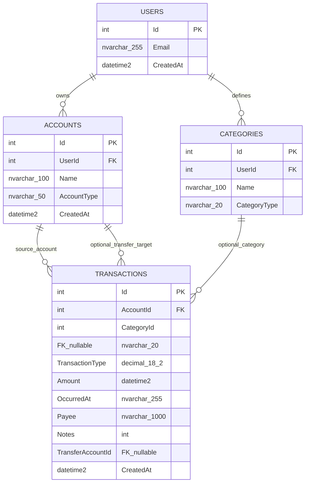

# Database Schema ERD

This is an Entity Relationship Diagram (ERD) for the current BudgetTracker database schema.

## Entity Relationship Diagram

## Key Constraints

- Unique index: ACCOUNTS (UserId, Name)
- Unique index: CATEGORIES (UserId, Name)
- Check constraint: CATEGORIES.CategoryType in (Expense, Income, Both)
- Check constraint: TRANSACTIONS.TransactionType in (Expense, Income, Transfer, Adjustment)
- Check constraint: TRANSACTIONS.Amount > 0
- Check constraint: transfer rows require TransferAccountId, non-transfer rows require TransferAccountId null
- Foreign keys use delete behavior NO ACTION

## Notes

- The application now uses TRANSACTIONS as the active ledger path.
- The legacy EXPENSES table has been retired from setup and the active domain model.
- The baseline EF migration is intentionally empty, so this ERD reflects SQL setup plus EF model configuration.