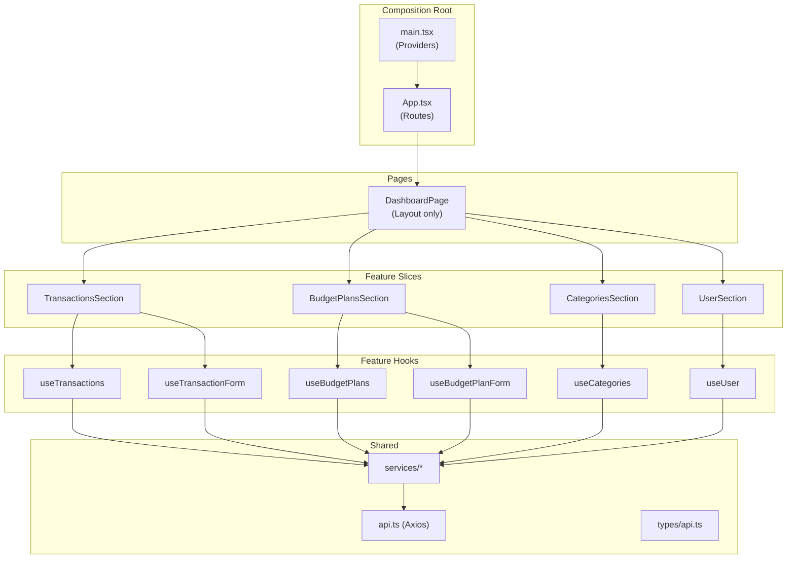

# Frontend Architecture

## Current State

The frontend is a React 19 + TypeScript + Vite application using TanStack React Query for server state and React Router for client-side routing. It is partially migrated to a feature-first folder structure.

### Current Folder Layout

```
src/
├── main.tsx                          # Composition root (Providers, Router)
├── App.tsx                           # Route table
├── index.css                         # Tailwind imports
├── app/
│   └── providers/                    # Empty — placeholder
├── components/
│   └── Dashboard.tsx                 # Dead wrapper → DashboardPage
├── features/
│   └── dashboard/
│       ├── pages/
│       │   └── DashboardPage.tsx     # God component (~450 lines)
│       └── components/
│           ├── DashboardHeader.tsx
│           ├── DashboardLoadingState.tsx
│           ├── DashboardErrorState.tsx
│           └── DashboardStatusBanner.tsx
├── lib/
│   ├── api.ts                        # Axios instance (baseURL: /api)
│   ├── useBudgetPlans.ts            # React Query hook
│   ├── useCategories.ts             # React Query hook
│   ├── useTransactions.ts           # React Query hook
│   └── useUser.ts                   # React Query hook
├── services/
│   ├── budgetPlan.service.ts        # CRUD API calls
│   ├── category.service.ts          # CRUD API calls
│   ├── transaction.service.ts       # CRUD API calls
│   └── user.service.ts              # API calls
└── types/
    └── api.ts                        # Shared TypeScript interfaces
```

### Diagnosed Problems

| Issue | Detail |
|-------|--------|
| **God component** | `DashboardPage` owns form state, mutation logic, derived data, and rendering for four separate domain concerns (User, Categories, Transactions, BudgetPlans). A change to transaction editing requires modifying the same file that renders budget plan tables. |
| **Misplaced hooks** | Domain-specific query hooks (`useTransactions`, `useBudgetPlans`, etc.) live in a global `lib/` folder instead of alongside the features they serve. |
| **Dead wrapper** | `components/Dashboard.tsx` is a pass-through to `DashboardPage` with no added value. |
| **Empty directory** | `app/providers/` exists but is unused. |

---

## Recommended Pattern: Feature-Sliced + Custom Hook Composition

This pattern aligns the frontend's volatility boundaries with the backend's IDesign decomposition. Each backend domain (Transaction Manager → Engine → Accessor) gets a 1:1 frontend feature slice.

### Target Folder Layout

```
src/
├── main.tsx                         # Providers (QueryClient, Router)
├── App.tsx                          # Route table
├── shared/
│   ├── api.ts                       # Axios instance
│   ├── types/api.ts                 # API contracts (shared across features)
│   └── components/                  # Truly shared UI (StatusBanner, etc.)
│
├── features/
│   ├── dashboard/
│   │   └── pages/DashboardPage.tsx  # Thin layout — composes section components
│   │
│   ├── transactions/
│   │   ├── hooks/
│   │   │   ├── useTransactions.ts       # Query hook (moved from lib/)
│   │   │   └── useTransactionForm.ts    # Form state + mutations
│   │   ├── components/
│   │   │   ├── TransactionTable.tsx
│   │   │   ├── AddExpenseForm.tsx
│   │   │   └── EditExpenseForm.tsx
│   │   └── TransactionsSection.tsx       # Composes hooks + components
│   │
│   ├── budget-plans/
│   │   ├── hooks/
│   │   │   ├── useBudgetPlans.ts
│   │   │   └── useBudgetPlanForm.ts
│   │   ├── components/
│   │   │   ├── BudgetPlanCard.tsx
│   │   │   ├── AddPlanExpenseForm.tsx
│   │   │   └── EditPlanExpenseForm.tsx
│   │   └── BudgetPlansSection.tsx
│   │
│   ├── categories/
│   │   ├── hooks/useCategories.ts
│   │   └── CategoriesSection.tsx
│   │
│   └── user/
│       ├── hooks/useUser.ts
│       └── UserSection.tsx
```

### Why This Pattern

**1. Mirrors the backend's IDesign decomposition.**
Each backend domain (TransactionAccessor, TransactionEngine, TransactionManager) has a matching frontend feature slice. When a product change touches "transactions," you know exactly which frontend folder changes — and nothing else.

**2. Custom hooks are the composition boundary.**
Instead of a god component managing 15+ `useState` calls, each feature slice gets a custom hook (e.g., `useTransactionForm()`) that encapsulates its own form state and mutations. This is the frontend analog of an Engine — pure logic, independently testable.

**3. DashboardPage becomes a thin layout:**

```tsx
export default function DashboardPage() {
  return (
    <div className="min-h-screen bg-gray-50">
      <DashboardHeader />
      <main className="max-w-7xl mx-auto px-4 sm:px-6 lg:px-8 py-8">
        <UserSection />
        <CategoriesSection />
        <TransactionsSection />
        <BudgetPlansSection />
      </main>
    </div>
  );
}
```

Each section component calls its own hooks, manages its own state, and renders its own UI. No prop drilling, no state lifting — React Query is the shared cache layer.

**4. Supports multiple pages naturally.**
When a dedicated `/transactions` page is added later, the same `TransactionsSection` or its sub-components can be imported directly. Feature slices are page-agnostic.

**5. Testable in isolation.**
Custom hooks like `useTransactionForm()` can be unit tested without rendering the entire dashboard. This aligns with the project's TDD goals.

### Architecture Diagram



---

## Migration Plan

Each step leaves the application in a working, buildable state.

| Step | What | Risk | Notes |
|------|------|------|-------|
| 1 | Move `lib/useUser.ts` → `features/user/hooks/`, extract `UserSection` from DashboardPage | Low | Smallest domain, read-only display |
| 2 | Move `lib/useCategories.ts` → `features/categories/hooks/`, extract `CategoriesSection` | Low | Read-only table, no form state |
| 3 | Extract transaction state + mutations into `useTransactionForm`, create `TransactionsSection` with `TransactionTable`, `AddExpenseForm`, `EditExpenseForm` | Medium | Largest form state extraction |
| 4 | Extract budget plan state + mutations into `useBudgetPlanForm`, create `BudgetPlansSection` with `BudgetPlanCard`, `AddPlanExpenseForm`, `EditPlanExpenseForm` | Medium | Most complex domain (nested plan lines) |
| 5 | Move `lib/api.ts` and `services/` into `shared/`, move `types/` into `shared/types/`, delete dead `components/Dashboard.tsx` wrapper, remove empty `app/` directory | Low | Cleanup pass |

After step 4, `DashboardPage` drops from ~450 lines to ~30.

---

## Key Principle

The pattern choice is driven by **aligning the frontend's volatility boundaries with the backend's**. The backend already groups by domain via IDesign (TransactionAccessor, TransactionEngine, TransactionManager). The frontend should mirror that so a product change to "how budget plans work" touches `features/budget-plans/` on the frontend and `BudgetPlan*` files on the backend. One axis of change, one place to look.
