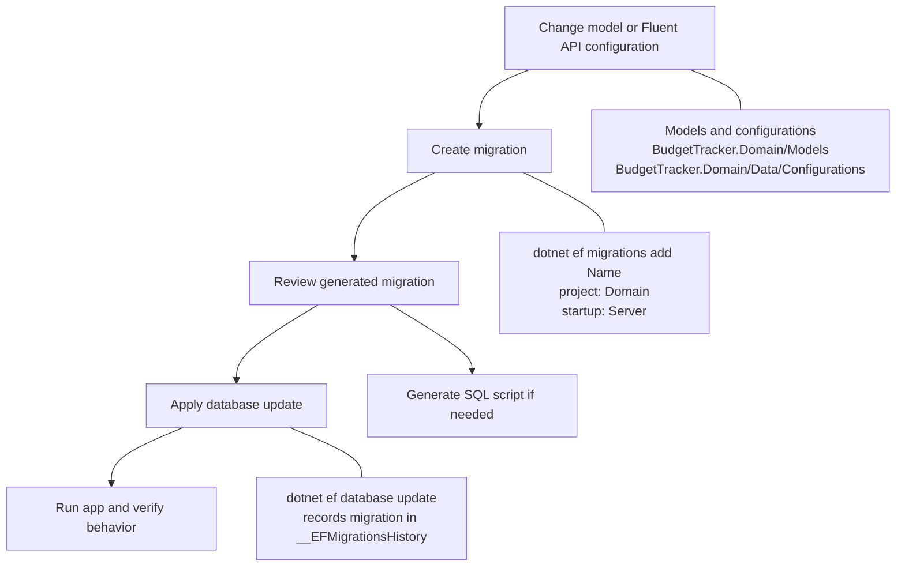
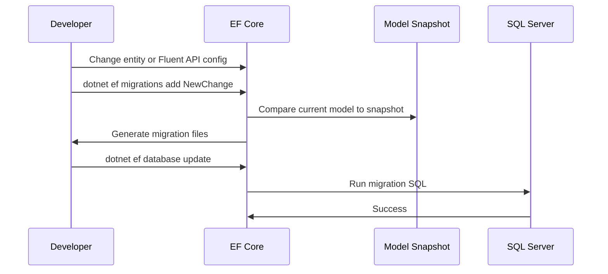
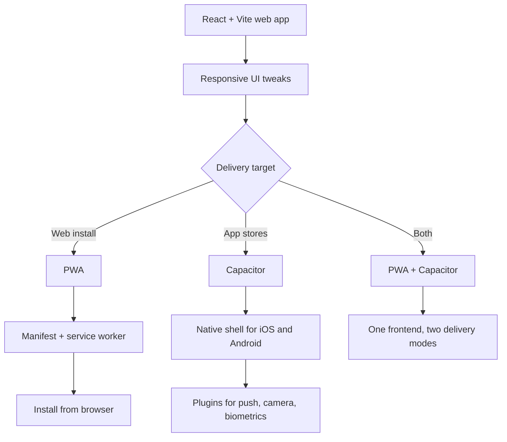

# Workflow Diagrams

This document shows the two main workflows we discussed for BudgetTracker:

- Entity Framework Core database changes
- Mobile delivery using Capacitor, with PWA as a companion option

## 1. Entity Framework Core Workflow





### What gets updated

- A new migration file pair in [BudgetTracker.Domain/Migrations](../BudgetTracker.Domain/Migrations)
- [BudgetTrackerDbContextModelSnapshot.cs](../BudgetTracker.Domain/Migrations/BudgetTrackerDbContextModelSnapshot.cs)
- The database schema through `__EFMigrationsHistory`

## 2. Mobile Delivery Workflow



```mermaid
sequenceDiagram
    participant Dev as Developer
    participant Web as React/Vite Build
    participant Cap as Capacitor
    participant iOS as iOS App
    participant And as Android App

    Dev->>Web: npm run build
    Web->>Cap: Web assets in dist/
    Dev->>Cap: npx cap sync
    Cap->>iOS: Update native project
    Cap->>And: Update native project
    Dev->>iOS: Open in Xcode
    Dev->>And: Open in Android Studio
```

### Why Capacitor fits BudgetTracker

- Reuses the existing React frontend
- Keeps a single codebase for web and mobile
- Lets you add native features later through plugins
- Avoids a rewrite in React Native

### Recommended next steps

1. Make the dashboard responsive on small screens
2. Add Capacitor for app-store builds
3. Add PWA support if you want install-from-browser behavior too
